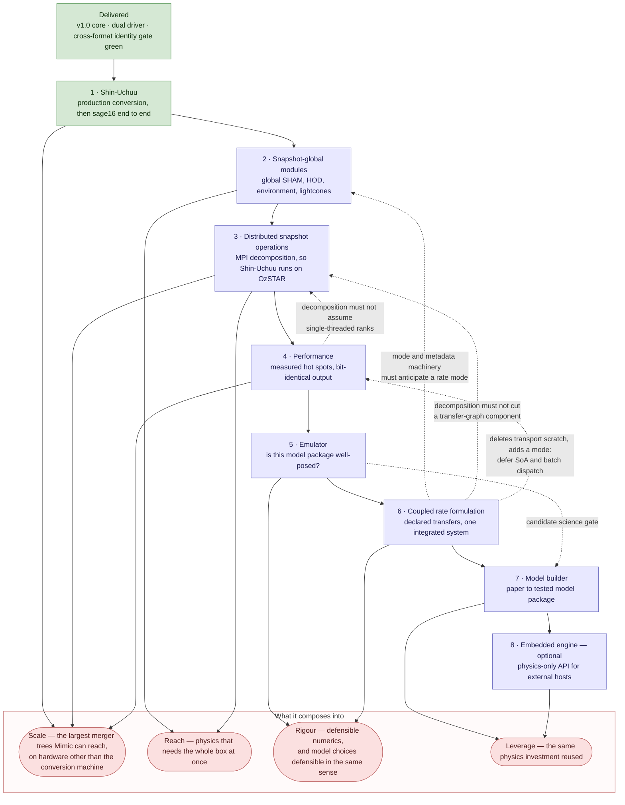

# Mimic Development Pathway

**Status:** Active planning index for `docs/dev/`.
**Date:** 2026-07-02 · **last revised 2026-09-17** — **F1 (Uchuu-family particle-mass fix) is closed.** All six Uchuu-family packages (`micro-uchuu`, `micro-uchuu-ascii`, `micro-uchuu-hdf5`, `micro-uchuu-horizontal`, `mini-uchuu`, `uchuu`) declared `particle_mass: 0.0325` where the physically consistent value (Ishiyama et al. 2021) is `0.0327`. The fix corrected all six packages' config and fixtures, regenerated the committed `micro-uchuu-horizontal` synthetic fixture, and re-converted and re-stamped the real local 50-file micro-Uchuu snapshot dataset from source — producer-validated, cross-checked, and swapped in with the pre-fix dataset preserved rather than deleted. All six packages rebuilt and tested clean; one unrelated latent test bug (`micro-uchuu`'s `test_lhalo_reader_halo_count`) was found and fixed along the way. Full record: `POST-PHASE-5-WORK.md` §2.7 and `POST-PHASE-5-JOINT-REVIEW.md` §6 item 10. **Every pre-Shin-Uchuu §6 item is now closed. Next up: F2 (merge `feature/ctrees-snapshot-reader` → `main`)** — see the NEXT TASK banner below. Before that, see [Completed Work](#completed-work) for the Shin-Uchuu flyby-defect remediation (R1–R15, closed 2026-09-17): `fix_flybys` deleted, horizontal format bumped to `format_version = 2`, the v2 production dataset re-converted and run through `sage16` to completion, all four science acceptance criteria passing exactly against their predicted targets. Full record: [`SHIN-UCHUU-FLYBY-DEFECT-ADDENDUM.md`](SHIN-UCHUU-FLYBY-DEFECT-ADDENDUM.md).
**Scope:** What is being built, in what order, and which document owns each piece. Current and future work only; everything finished is consolidated in [Completed Work](#completed-work) at the end.

> ### ► NEXT TASK (fresh session): F2 — merge `feature/ctrees-snapshot-reader` → `main`
> **F1 (Uchuu-family particle-mass fix) closed 2026-09-17.** All six Uchuu-family packages corrected from `0.0325` to `0.0327` Msun/h (×1e10), with the committed `micro-uchuu-horizontal` fixture regenerated and the real local 50-file dataset re-converted, re-validated, and swapped in. Full record: `POST-PHASE-5-WORK.md` §2.7 and `POST-PHASE-5-JOINT-REVIEW.md` §6 item 10. **Every pre-Shin-Uchuu §6 item (1–11) is now closed** — nothing outstanding blocks the merge on correctness grounds.
>
> **F2 — merge `feature/ctrees-snapshot-reader` → `main`.** This is a git action the branch owner takes explicitly; it is not to be done unprompted. Before merging, confirm: the working tree is clean and the F1 commit(s) are in place; `make tests summary` is green for the default `MODEL=sage16 SIMULATION=mini-millennium` selector; and the branch's own commit history (from `main..HEAD`) reads as a coherent record for anyone reviewing the merge.
>
> **The durable memory problem is unchanged and still separate**: [`MIMIC-CHUNKED-SLAB-STREAMING-PLAN.md`](MIMIC-CHUNKED-SLAB-STREAMING-PLAN.md) remains the concept note for a host-independent memory bound, motivated by Shin-Uchuu's real P5 memory finding. Nothing in F2 depends on it, but it is the thing that would unblock every run after Shin-Uchuu without depending on host size at all — worth promoting to a requirements brief when convenient, not before F2.
>
> Current branch: `feature/ctrees-snapshot-reader`. F1 has landed; F2 (the merge itself) is next, pending the branch owner's go-ahead.

---

## Purpose

The entry point for active development plans. It answers three questions and delegates everything else: what is being built, in what order, and which document owns the details.

The architectural direction is governed by `docs/VISION.md`: Mimic is a physics-agnostic core with runtime-configurable physics modules, metadata as structural truth, explicit validation, bounded memory, and reproducible output provenance.

---

## The Work In One Picture

Eight pieces remain. Most are worth building on their own — distributed operation is the exception, having nothing to distribute until a snapshot-global contract exists — but the reason to sequence them deliberately is that several are worth considerably more in combination than apart.

**Reading it.** The numbered chain is the **planned order**, not a dependency chain — only one link is a genuine hard dependency, distributed operation needing a snapshot-global contract to exist. The dotted arrows are the couplings that explain why the order is what it is, and **four of them point backwards**: coupled-rate work constrains the design of steps 2, 3 and 4 even though it is scheduled after them, and the performance work constrains step 3's decomposition for the same reason. Those constraints are knowledge rather than code, so they can be honoured in advance — and must be, which is why they are drawn.

**Where the value compounds.** Three couplings are worth more than the sum of their parts, and each is a reason to care about sequencing rather than only about scope:

- **Emulator with model builder.** The builder specifies physical invariants, paper-figure parity and regression against trusted baselines, but its hardest unsolved problem is defining scientific "done" for a *novel* model, where no trusted baseline exists to regress against. The emulator is the only candidate on record for that part of its science-gate layer — a candidate rather than a prerequisite, since a different instrument could satisfy the same precondition.
- **Coupled rate with everything downstream.** A declared, side-effect-free transfer contract is simultaneously what makes the embedded engine's process path tractable, what a paper's equations map onto most directly for the builder, and a better-behaved design vector for the emulator. It is the single interface decision with the widest downstream reach — which is why steps 2, 3 and 4 must be designed knowing it is coming.
- **Horizontal driver with snapshot-global modules.** The driver already makes a whole snapshot population co-resident; without a module contract that can see that population, none of the methods motivating the dual-driver work — global abundance matching, environment, lightcones — are reachable. The scientific payoff is in the pair, not in the driver alone.

Taken together the intended destination is a framework in which a galaxy formation model can be **built from published evidence, tested for identifiability, run at the largest available scale, and compared against alternatives on stated and comparable priors** — each of those backed by recorded evidence rather than by assertion, which is the standard the rest of this repository already holds itself to.

---

## The Ordered Road

**Ordering decided 2026-08-20, and it settles the former A/B question.** Snapshot-global work precedes coupled-rate work, which is the old "Option B". Its recorded cost — the dispatch and metadata machinery being extended twice, the second extension reconciling with the first — is accepted knowingly, because the coupled rate formulation is now treated as **certain rather than contingent**: sequential operator splitting has no defined answer to adjudicate, since permuting a run file's module list changes the result and that ordering carries no physics. Because it is certain, the cost is mitigated by design rather than by sequencing — steps 2, 3 and 4 are built against a known future contract, per the backward arrows above.

| Step | Work | Owned by | Gate or next action |
|---|---|---|---|
| **1** | **Shin-Uchuu** — production conversion and `sage16` end to end | [`SHIN-UCHUU-CONVERSION-PLAN.md`](SHIN-UCHUU-CONVERSION-PLAN.md) for both the design and the execution sequence (P1–P9, F1–F2); addendum [`SHIN-UCHUU-FLYBY-DEFECT-ADDENDUM.md`](SHIN-UCHUU-FLYBY-DEFECT-ADDENDUM.md) for the R1–R15 remediation, now closed; converter operation in [`scripts/convert/README.md`](../../scripts/convert/README.md); checklist at [`POST-PHASE-5-JOINT-REVIEW.md`](POST-PHASE-5-JOINT-REVIEW.md) §6 | See [Step 1](#step-1-shin-uchuu-closed). **CLOSED 2026-09-17.** Sub-steps 1.1–1.4 closed earlier; 1.5 reopened by the flyby defect, then closed by the R1–R15 remediation — see the NEXT TASK banner above for what's next (F1, then F2) |
| **2** | **Snapshot-global modules** — the horizontal driver's scientific payoff | [`MIMIC-SNAPSHOT-GLOBAL-MODULES-PLAN.md`](MIMIC-SNAPSHOT-GLOBAL-MODULES-PLAN.md) | Promote to an implementation plan; the first module is a true global SHAM. **Design its mode and metadata machinery as an open set** — it must host a rate mode (step 6) and may need to host a batch mode (step 4), and it is the first work to extend Principle 4's closed list of three, so it owns that amendment |
| **3** | **Distributed snapshot operations** — MPI domain decomposition | [`MIMIC-DISTRIBUTED-SNAPSHOT-PLAN.md`](MIMIC-DISTRIBUTED-SNAPSHOT-PLAN.md) | Needs step 2 to exist first — the one hard dependency in the chain. **Treat the transfer-graph non-cutting rule as binding from the first design sketch** |
| **4** | **Performance** — measured hot spots, bit-identical output | [`OPTIMISATION-SPECTRUM.md`](OPTIMISATION-SPECTRUM.md), on the evidence in [`BENCHMARK-SAGE16-MINI-MILLENNIUM.md`](BENCHMARK-SAGE16-MINI-MILLENNIUM.md) | Promote the spectrum's Tier A to an implementation plan; re-measure before acting (see [Step 4](#step-4-performance)). **Do not introduce a dispatch mode here** — the machinery is step 2's, extended by step 6 |
| **5** | **Emulator** — is a model package well-posed, and what constrains what | [`MIMIC-EMULATOR-PLAN.md`](MIMIC-EMULATOR-PLAN.md) | Run its calibrated-variance spike, outside the product tree entirely |
| **6** | **Coupled rate formulation** — declared transfers, one integrated system | [`MIMIC-COUPLED-RATE-FORMULATION-PLAN.md`](MIMIC-COUPLED-RATE-FORMULATION-PLAN.md) | Run its measurement spike — new files under `models/` only, no core change. The spike sets priority, solver family and the attribution baseline; it is **not** a veto |
| **7** | **Model builder** — paper to tested model package | [`MIMIC-MODEL-BUILDER-PLAN.md`](MIMIC-MODEL-BUILDER-PLAN.md) | Refresh the brief against the tagged v1.0 baseline; its re-review has been due since 2026-08-12 |
| **8** | **Embedded engine** — optional, possibly never | [`MIMIC-EMBEDDED-ENGINE-PLAN.md`](MIMIC-EMBEDDED-ENGINE-PLAN.md) | Nothing depends on it. Promote only if a scientific need arises |

**A candidate insertion before step 2, not yet decided: converter generalisation.** [`MIMIC-CONVERTER-GENERALISATION-PLAN.md`](MIMIC-CONVERTER-GENERALISATION-PLAN.md) is a concept note, not a committed step — it is deliberately not numbered above, not in the mermaid diagram, and not counted among the "eight pieces" this page otherwise tracks. It surfaced from the completed Shin-Uchuu production conversion: the converter's column selection is a single hardcoded struct (`RECORD_DTYPE` in `scripts/convert/ctrees_parser.py`) rather than declared per-simulation metadata, which is both the central question a converter generalised to other simulations has to answer and the reason recovering a column discarded from Shin-Uchuu's own conversion is expensive today. Whether this should land before step 2 — on the reasoning that step 2's snapshot-global modules may want a wider variety of converted simulations to validate against, and that a declarative column-mapping mechanism is scale/reach infrastructure in the same vein as step 1 rather than the physics-content work step 2 is — or can be deferred without blocking step 2, is recorded as open in that note rather than decided here. Promote it to a requirements brief when it is time to weigh that call.

**A second candidate, needing no prerequisite step at all: chunked slab streaming.** [`MIMIC-CHUNKED-SLAB-STREAMING-PLAN.md`](MIMIC-CHUNKED-SLAB-STREAMING-PLAN.md) is likewise a concept note, not a committed step — unnumbered, absent from the mermaid diagram, not among the "eight pieces." It surfaced from P5's real memory finding on the Shin-Uchuu production run (see the NEXT TASK banner and [Step 1](#step-1-shin-uchuu-closed) below): the horizontal driver's peak memory scales linearly with the halo count of its single largest slab, uncapped, and today's only specified mitigation (the compact previous-slab projection) closes barely a tenth of the gap at Shin-Uchuu's actual production scale. Unlike the converter-generalisation note, this one needs no sequencing decision relative to step 2 — it is a raw driver memory bound, orthogonal to which physics modules run or whether MPI is in play, so it could in principle be picked up whenever it is convenient rather than waiting on anything else in this table. It is **more load-bearing than a passive future idea**: the owner has stated a firm intent to run Shin-Uchuu (and larger future simulations) repeatedly, including eventually on a single local machine, so the NT-relocation that unblocked today's run is explicitly a stopgap, not a substitute for this. Promote it to a requirements brief when it is time to flesh it out fully.

**Why the emulator precedes the coupled rate work.** It is an instrument: built early it can measure everything after it, built late it measures nothing. Concretely, the coupled-rate brief's gate item 5 requires the new package's differences from the control to be quantified, and a point calibration cannot compare two structures on equal footing because each is judged at one hand-tuned operating point.

**Why distributed operation is step 3 rather than later.** Its recorded triggers were a larger simulation or wall-clock pressure. The nearer driver is deployment: Shin-Uchuu is meant to be run by students on OzSTAR, where per-node memory is smaller and work spreads across nodes. Note the boundary — MPI decomposition serves the cluster case, not a single low-memory workstation, where the rehearsal's subset dataset is the relevant artifact instead.

**Why performance is step 4 — after the scale work, before the science instruments.** Three reasons, in decreasing strength.

- **It should be written against the finished scale architecture, not ahead of it.** The dominant hot spot is `execute_phase`, which both drivers share; step 2 extends the dispatch machinery and step 3 changes how ranks divide work. Optimising the dispatcher before those land means optimising a structure about to change, and re-doing the measurement anyway. Note this argument covers the Tier A dispatch work (4.1, 4.2) and **not** thread-per-forest (4.3), which is vertical-driver work that steps 2 and 3 do not touch.
- **The coupled-rate work should be written in an optimised state, not the reverse.** It replaces the substep loop wholesale. Landing the cheap core wins first means its measurement spike — a repeated-run exercise — compares solver families against a clean baseline rather than one carrying ~15–25% of removable overhead.
- **It is cheap and self-contained.** Tier A is days-to-weeks of bit-identical work with no vision change and no baseline regeneration, so it can be taken whenever it is convenient without disturbing anything around it.

**What this rationale deliberately does not claim.** An earlier draft argued that emulator campaigns (10²–10³ runs) would multiply any single-run saving. [`MIMIC-EMULATOR-PLAN.md`](MIMIC-EMULATOR-PLAN.md) refutes that: those campaigns "parallelise across cores with no shared state", so a 10³-run campaign at ~3 s over ten cores is minutes, and — more sharply — **thread-per-forest buys a core-saturated campaign nothing at all**, because campaign processes already occupy every core. Step 4 is placed here for the reasons above, not because step 5 needs it.

**Two honest costs of putting it here.**

1. **Tier A would benefit step 1's production Shin-Uchuu runs if taken earlier.** A real forgone gain, accepted deliberately: step 1 is blocked on an operator rather than on wall time, and pulling core changes forward would put an unvalidated dispatcher under the conversion rehearsal, which must certify the *final* runtime.
2. **Step 3 may be reworked by 4.3.** Whether ranks are threaded determines the per-rank memory budget, ghost duplication, the load-balance unit, and the required `MPI_THREAD_*` level — implementation commitments, not knowledge held in reserve. The globals-instancing refactor that item 16 needs is also substantially what a rank-parallel design wants, and it is already half done. **A reviewer argued 4.3 should therefore precede step 3.** The counter-argument is recorded here rather than acted on: the ordering above is a deliberate choice to finish the scale work before opening a concurrency front. If step 3's design sketch finds the thread model genuinely blocking, revisit this rather than working around it.

### Step 1: Shin-Uchuu (closed)

Work these in order; each step's output is the next step's input. **All of 1.1 through 1.5 are closed.** 1.5 executed as steps P3b–P9 of `SHIN-UCHUU-CONVERSION-PLAN.md` → "The Production Execution Sequence" (P1–P3), then as the R1–R15 flyby-defect remediation once P8 reopened it.

| # | Work | Status, and why here |
|---|---|---|
| **1.1** | ~~**§6 item 6 — subset conversion + complete rehearsal, creating `simulations/shin-uchuu/` and `simulations/shin-uchuu-ascii/` as part of it**~~ | **CLOSED 2026-08-26.** A whole-forest subset was selected with `scripts/convert/subset.py`, converted, and exercised end to end at **406,668,896 halos** under both `halos-only` and `sage16`, instrumented for peak RSS, `C`, `P`, `G`, the `Spin` extrema, the remaining property ranges and the writer cost. The package could not be completed first: its identity multiplier must come from the conversion report and never from an assumption, its `snapshots/` symlink points at files the conversion had not produced, and `Len`, `Spin` and core `deltaMvir` needed calibration from a real run. The one thing it could not do — the percolation super-forest is excluded, because the vertical driver cannot load it (C5/C6) — is a carry-forward, and is why the production `Spin` scan (P4) is binding rather than a formality |
| **1.2** | ~~**Close §6 items 2, 3 and 9** from those measurements~~ | **CLOSED 2026-08-26.** `Spin` `[-1000, 1000]` not refuted (measured `[-11.673591, +17.797567]` over all 406,668,896 halos); `Vmax`'s inherited floor corrected to `[0.0, 5000.0]` in both packages; the population check clear at `P`/N = 0.99701; memory closed on measured peak RSS, projecting ≈476.6 GB. The 85%-of-RAM trigger was crossed and the compact previous-slab projection was **deferred by owner decision**, conditional on item 11's seed headroom, which landed |
| **1.3** | ~~**§6 item 7 — converter scale-engineering pass (D4)**~~ | **CLOSED 2026-08-28.** Nine slices, landed as `184424df`…`b2ae9601` plus `0ab453fe` early, under its own frozen implementation plan (complete and archived). Its acceptance gate ran green on a **fresh** micro-Uchuu conversion the rebuilt converter itself produced: producer battery 15/15, topology cross-check 8/8, zero unexplained mismatches, plus rehearsal-scale memory profiles for `links`, the battery and the cross-check. Record: `SHIN-UCHUU-CONVERSION-PLAN.md` → "Pass complete" |
| **1.4** | ~~**Full production conversion** — one-time, 11.61 TB → 70 snapshot files~~ | **CLOSED 2026-09-03.** Steps **P1–P3** of the execution sequence, executed and measured: **22,503,649,037 halos**, **2.2520 TB** emitted across 70 snapshot files plus `forests.h5` — the snapshot files alone are 2.2507 TB = 100.01 B/halo — within 2.5% of the ≈2.31 TB pre-run projection (the "2.0 TB" first recorded here was a macOS `du -sh` TiB/TB unit error, corrected 2026-09-09). `unique_galaxy_id_multiplier: 20000000000` set and committed (`5506ef88`). Record: `SHIN-UCHUU-CONVERSION-PLAN.md` → "Production run complete" |
| **1.5** | **Production run + science checks** — `sage16` end to end, then HMF and GSMF at z = 0, 1, 2 | **CLOSED 2026-09-17.** P6 succeeded 2026-09-07 (job `16267967`, 472.3 GB peak RSS, 17h04m43s, ≈543.4 GB output); P7 passed 2026-09-08. **P8's science check then failed on its first figure** — `BaryonFraction` reached 0.35 against a cosmic 0.17. Root cause `fix_flybys()`: 33.0% of the z=0 galaxy population was in one bogus FoF group, confined to snapshot 69. **Remediated end to end (R1–R15)**: `fix_flybys` deleted, format bumped to `format_version = 2`, fix verified on micro-Uchuu across all three readers (R1–R7, committed `a654c228`+`5005cd49`); Shin-Uchuu re-converted to v2 (5d18h35m, R8+R9) and re-pointed (R10); `sage16` re-run locally on the corrected dataset (9h35m, 513.0 GB peak RSS, R12) and all four science acceptance criteria passed **exactly** against their predicted targets, including an exact match on the z=0 Type-0 count (244,953,607) and the full six-bin halo mass function (R13); v1 artefacts retired to named archive locations, nothing deleted (R14); NT and local cleanup, Definition of Done (0–11) confirmed in full (R15). Full record: [`SHIN-UCHUU-FLYBY-DEFECT-ADDENDUM.md`](SHIN-UCHUU-FLYBY-DEFECT-ADDENDUM.md). P6/P7's original measurements stand as evidence the pipeline works at this scale; their v1 science output is void and has been superseded by v2's. The durable generic memory fix remains separate and unstarted: [`MIMIC-CHUNKED-SLAB-STREAMING-PLAN.md`](MIMIC-CHUNKED-SLAB-STREAMING-PLAN.md) |

**Starting a fresh session on step 1 — read these, in this order.** [`SHIN-UCHUU-CONVERSION-PLAN.md`](SHIN-UCHUU-CONVERSION-PLAN.md) → "Where The Work Runs", then "Pre-conversion obligation" → "Pass complete" (the converter's measured record), then **"The Production Execution Sequence"**, which is what you execute and which carries C4/C5/C6/C9/C10/C11/C15 with their code evidence. [`scripts/convert/README.md`](../../scripts/convert/README.md) is how you drive the converter — commands, workdir layout, resume semantics, `--pool-size`, consumptive deletion, batch mode, the storage envelope, and the converter suite's **610-test / exit-0** baseline. [`HORIZONTAL-HDF5-FORMAT.md`](HORIZONTAL-HDF5-FORMAT.md) is the frozen output contract. [`POST-PHASE-5-JOINT-REVIEW.md`](POST-PHASE-5-JOINT-REVIEW.md) §6 is the authoritative checklist and [`POST-PHASE-5-WORK.md`](POST-PHASE-5-WORK.md) §6 carries "Carried into the production run". For build, environment and test mechanics use the project-local skills named in `.claude/CLAUDE.md` — `mimic-build-and-env`, `mimic-run-and-operate`, `mimic-validation-and-qa`, `mimic-diagnostics-and-tooling`, `mimic-change-control` before every commit. The conversion phases and the production run all exceed any short command timeout: run them detached and poll, per the execution sequence's closing note.

**Subset selection was designed 2026-08-25 and was the rehearsal's first task; it is built and was used.** The composition constraint below had been stated in four places and operationalised in none; `SHIN-UCHUU-CONVERSION-PLAN.md` → "Subset Selection and Extraction" specifies the whole route — rank forests by size from `forests.list` + `locations.dat` alone (21.3 GB), sample one root row per candidate tree remotely to get exact masses (~1 GB of scattered reads), select a random stratum plus a high-mass supplement, extract whole forests by streaming byte ranges on the data node, and verify before transferring. The bulk 11.61 TB is never read for selection. It is built, as `scripts/convert/subset.py`, and documented in `scripts/convert/README.md` → "Building a subset of a very large dataset".

**Subset composition decided whether the rehearsal certified anything, and this is the constraint the executed subset was built to.** It had to span the earliest snapshots through z=0 and satisfy **both** halves of the D9 design constraint: include the most massive forests **and** a representative low-mass sample. The most massive forests exercise the `Spin` range and the memory ceilings; the low-mass population drives the orphan statistics that set `C` and `G` — which is exactly what a ≈360× finer particle mass changes between micro-Uchuu and Shin-Uchuu. A randomly chosen subset passes while certifying nothing, and a most-massive-only subset measures the ceilings while leaving the ratio unvalidated. `POST-PHASE-5-JOINT-REVIEW.md` D9 owns the constraint.

**All §6 items are now closed.** Items 1, 4, 5 and 8 closed earlier; **2, 3, 6 and 9 closed 2026-08-26** from the rehearsal's measurements; **11 closed 2026-08-26** (the output-buffer seed headroom, at a 5% seed); **7 closed 2026-08-28** (the converter scale pass); **10 closed 2026-09-17 as F1** (the Uchuu-family particle mass). `POST-PHASE-5-JOINT-REVIEW.md` §6 is authoritative for the numbering; `POST-PHASE-5-WORK.md` §6 holds the same table plus **"Carried into the production run"** — the obligations those closures themselves created, which the execution sequence's P4 and P5 discharge. Neither document's non-blocking residue blocks any of the above.

**§6 item 10 (Uchuu-family particle mass), closed 2026-09-17 as F1.** Six packages declared 3.25 × 10⁸ Msun/h where the consistent value is 3.27 × 10⁸ — a real correctness defect that moved Uchuu science output through `virial.c:51`. The fix re-stamped the committed fixture and the real 50-file micro-Uchuu dataset, keeping both sides of the header-agreement check in agreement so the cross-format identity gate and every horizontal-format run stay green. Its prerequisite was discharged 2026-08-20 (640³ and 2560³ confirmed); full analysis and closure record in `POST-PHASE-5-WORK.md` §2.7.

**Where the Shin-Uchuu source data lives.** OzSTAR/Ngarrgu Tindebeek, `ssh dcroton@nt.swin.edu.au`. This is a pointer to the data, not permission to start converting.

| Path under `/fred/oz214/simulations/uchuu/shinuchuu/` | Contents |
|---|---|
| `mergertrees/` | **11.61 TB apparent** (5.6 TB as `du` reports it), 2,744 `tree_*.dat` ctrees-ASCII files plus `forests.list` and `locations.dat` — the converter's input |
| `halos/` | 42 GB `ShinUchuu_halolist_9p35.h5` |
| `shinuchuu_scalefactor.txt` | 70 scale factors, 0.0477 → 1.0000, in the format the a_list contract wants |
| `shinUchuu_snapshot_redshift_scalefactor.txt` | the same list with snapshot numbers and redshifts, z = 19.9490 → 0.0000 |
| `shinuchuu.par` | the producer's own SAGE parameter file, independently confirming `PartMass 0.0000897`, `BoxSize 140.0`, `Omega 0.3089`, `OmegaLambda 0.6911`, `Hubble_h 0.6774`, `TreeType consistent_trees_ascii`, `LastSnapShotNr 69`, `NumSimulationTreeFiles 2744` |

**Re-measured 2026-08-25, and three figures moved.** `mergertrees/` is **11.61 TB apparent** across 2,744 `tree_*.dat`, not 5.6 TB — `du` under-reports `st_blocks` on that Lustre filesystem, and the data was NUL-probed to confirm it is dense rather than sparse. `forests.list` is **7.56 GB**, not 17 GB (its 24.0 B/line width corroborates the 315,004,242 tree count exactly). Total halos are **≈22.9 billion** at a measured 506.3 B/row, not 15–18 billion at an assumed 350. Consequences are recorded in the conversion plan's Feasibility section: output HDF5 **≈2.31 TB** (100.7 B/halo measured at rehearsal scale × 22.9 × 10⁹ — this supersedes the ≈2.29 TB analytic figure that stood on 2026-08-25 and is the number used everywhere below), the shipped in-memory rank pass ≈1.10 TB, and transfer ≈29 h at a **measured** 110 MB/s.

**Two rank-pass figures on this page are superseded analytic history — do not plan against either.** The ≈1.10 TB above and the "~17.5 GB at rehearsal scale" that accompanied it were both *parametric projections* of the pre-pass in-memory rank pass. Measurement replaced both: the rehearsal measured **76.39 GB peak RSS at 406,668,896 halos** (4.4× the ~17.5 GB projection), implying **≈4.30 TB at production** rather than 1.10 TB. The external-merge rank core then removed the term entirely — the same rehearsal-scale pass now measures **9.76–10.01 GB** (`SHIN-UCHUU-CONVERSION-PLAN.md` → "Pass complete"), and the binding link-stage term at production is the per-snapshot window at **≈225–235 GB projected**, to be re-derived at step P5. The 2026-08-25 conclusion the ≈1.10 TB supported — that the external-merge sort was mandatory — was right, and holds by a wider margin.

### Step 4: Performance

[`OPTIMISATION-SPECTRUM.md`](OPTIMISATION-SPECTRUM.md) is the options catalogue — 40 entries, each classified by VISION principle, scientific risk and cost, ordered by expected value. It is **not** a plan, and promoting it needs three things decided.

| # | Work | Why here |
|---|---|---|
| **4.1** | **Re-measure, then promote Tier A to a frozen implementation plan** | The spectrum's own caveat is binding: `-O2` folds static helpers into their translation unit, so per-component totals are trustworthy but per-line attribution inside `execute_phase` is not. Confirm what lives at `module_registry.c:882`, `:870` and `:835` with a dispatch counter before committing to items 1, 2 or 32. Two instruments are missing and cheap: a dispatch counter, and a `--no-output` diagnostic flag |
| **4.2** | **Tier A — items 1–12, 14, 15 (the bit-identical set)** | ~15–25% estimated, days to weeks, no output byte changes, no baseline regeneration, no vision change. Item 13 (build flags: LTO, `-O3`) is **not** in that set — it is possibly FP-perturbing and is promoted separately against the physics baseline. The two largest are the `DEBUG_LOG` gate (4.15% measured) and precomputed mode-partitioned phase plans (33% of inner-loop iterations currently only fail a mode test). Every item must clear the byte-identical physics baseline |
| **4.3** | **Thread-per-forest parallelism** — 6–9× estimated, still bit-identical | The largest bit-identical win available (estimated), with **no unmet precondition**: determinism is already verified (no RNG in the physics path, module `static`s are write-once at `init()`, `GlobalForestOffset` is rank-independent). The blocker is enumerable global mutable state. **Bit-identity is an acceptance criterion here, not a property to check afterwards**: step 5 depends on one parameter set producing exactly one output, and this item introduces threads upstream of it. **Sequence against step 3** — an MPI decomposition designed for single-threaded ranks will be reworked here, which is why the backward arrow exists |
| **4.4** | **Stop, and re-measure before going further** | Tiers B and C past this point are months of work whose value depends on what 4.2 and 4.3 left. SoA and batched dispatch are explicitly deferred — see below |

**Deferred out of this step:** batched dispatch and the SoA generator (spectrum items 17, 19) — the coupled-rate work deletes the transport-scratch state SoA would transpose, and the mode machinery belongs to step 2. See the spectrum's "Read This First".

**Already ruled out, with measurements:** module-major interchange (illegal), static fusion and language changes (they target a ~2% prize), GPU offload at this scale, and substep reduction. See the spectrum's Tier D before re-proposing any of them.

---

## Plan Inventory

Every document in `docs/dev/`. This file is the index itself. (This table was formerly called "Active Plans"; some executed plans still refer to it by that name.)

| Document | Status | Role |
|---|---|---|
| root `HANDOFF.md` | **No live copy right now.** The flyby-defect-remediation handoff (2026-09-09 to 2026-09-17) is archived — see the row below. A fresh one opens if a future session wants a working-file entry point for F1/F2 | None currently; this file is the entry point until one exists |
| root `HANDOFF.md` (2026-09-17 predecessor, flyby-defect remediation) | **Archived 2026-09-17** as `HANDOFF-2026-09-17-flyby-defect-remediation-complete.md` | Carried sessions A–I of the flyby-defect remediation, 2026-09-09 to 2026-09-17: the defect discovery, R1–R7's fix and validation, R8–R9's production re-conversion, R10–R13's post-conversion and science checks, and R14–R15's closeout. Every fact it held is in [`SHIN-UCHUU-FLYBY-DEFECT-ADDENDUM.md`](SHIN-UCHUU-FLYBY-DEFECT-ADDENDUM.md), which is what this pathway and any other committed document cites |
| root `HANDOFF.md` (2026-08-28 predecessor) | **Archived 2026-08-28** | Carried the operational sequence from a cold start through the subset rehearsal to the production conversion's start line, 2026-08-25 to 2026-08-28. Retired once every fact and step it held was moved into committed documents: the execution sequence and its constraints into `SHIN-UCHUU-CONVERSION-PLAN.md` → "The Production Execution Sequence", converter operation into `scripts/convert/README.md`, and the entry-point role into this file. Its record, and the earlier rehearsal handoff, are under `archive/handoffs/` (gitignored local history) |
| [`SHIN-UCHUU-CONVERSION-PLAN.md`](SHIN-UCHUU-CONVERSION-PLAN.md) | **Step 1 closed; retained as the design/algorithm reference** | Converter built and micro-Uchuu-validated; owns the format, algorithm, measured source data, machine/storage decision and the subset-selection design. **Its own P1–P9 outcome status is superseded and v1-historical** — the addendum's R1–R15 sequence is the plan of record for what actually shipped (v2). Still load-bearing for the operational detail: flag semantics, storage/memory envelopes, converter mechanics |
| [`SHIN-UCHUU-FLYBY-DEFECT-ADDENDUM.md`](SHIN-UCHUU-FLYBY-DEFECT-ADDENDUM.md) | **CLOSED 2026-09-17 — R1–R15 all complete, Definition of Done 0–11 satisfied** | Addendum to the conversion plan. Owns the `fix_flybys` defect found by P8 on 2026-09-09: the evidence, decisions D1–D10 (delete `fix_flybys`; keep `micro-uchuu-ascii`; `format_version = 2` with v1 rejected outright; re-convert on the Mac Studio rather than repair in place or move to NT; attempt P6 locally with the host chosen at R11 on measured evidence; keep four transfer batches; no new source columns (D6); the three fix_flybys-contract replacements (D9); v1 deleted locally, NT sole copy (D10)), the complete R1–R15 remediation sequence with dated DONE records for every step, measured costs, and the Definition of Done numbered 0–11, all now satisfied. **Supersedes the conversion plan's P1–P9 outcome status**, which is now v1 historical evidence |
| [`POST-PHASE-5-JOINT-REVIEW.md`](POST-PHASE-5-JOINT-REVIEW.md) | **Open — owns step 1's ordering** | Holistic review of the Phase 5 change set; its §6 is the authoritative pre-Shin-Uchuu checklist, §4 holds decisions D1–D10, §8 records what has landed |
| [`POST-PHASE-5-WORK.md`](POST-PHASE-5-WORK.md) | **Open** | Everything deferred, reported-but-not-fixed, or discovered during Phase 5. §2 is the pre-Shin-Uchuu detail, §3 non-blocking hygiene. **Its §6 ordering is superseded by the joint review's §6** |
| [`MIMIC-CONVERTER-GENERALISATION-PLAN.md`](MIMIC-CONVERTER-GENERALISATION-PLAN.md) | Concept note — candidate, not scheduled | Generalising `scripts/convert/` beyond Shin-Uchuu via declarative column selection, and a candidate cheaper path for adding a column to an already-converted dataset. Whether it precedes step 2 is open, not decided |
| [`MIMIC-CHUNKED-SLAB-STREAMING-PLAN.md`](MIMIC-CHUNKED-SLAB-STREAMING-PLAN.md) | Concept note — candidate, not scheduled | A generic, host-independent memory bound for the horizontal driver — chunked/streamed slab processing so peak memory is a function of chunk size, not of the largest slab a given simulation happens to produce. Needs no prerequisite step. Arose from Shin-Uchuu's P5 memory finding |
| [`MIMIC-SNAPSHOT-GLOBAL-MODULES-PLAN.md`](MIMIC-SNAPSHOT-GLOBAL-MODULES-PLAN.md) | Requirements brief — step 2 | Module contracts over a co-resident snapshot population; prerequisite met 2026-08-12 |
| [`MIMIC-DISTRIBUTED-SNAPSHOT-PLAN.md`](MIMIC-DISTRIBUTED-SNAPSHOT-PLAN.md) | Requirements brief — step 3 | MPI decomposition for snapshot-global operations; blocked on step 2 existing |
| [`OPTIMISATION-SPECTRUM.md`](OPTIMISATION-SPECTRUM.md) | Options catalogue — step 4 | Forty classified optimisation options ordered by expected value; needs promoting to an implementation plan before any of it is built |
| [`BENCHMARK-SAGE16-MINI-MILLENNIUM.md`](BENCHMARK-SAGE16-MINI-MILLENNIUM.md) | Standing evidence | Component-level CPU profile of the default run at `48ffc244`, attributed along VISION boundaries and validated against a differential experiment to 1 percentage point. **Perishable — one machine, one dataset, one commit; re-measure with [`scripts/profiling/`](../../scripts/profiling/) before acting** |
| [`MIMIC-EMULATOR-PLAN.md`](MIMIC-EMULATOR-PLAN.md) | Requirements brief — step 5 | Emulator-based model diagnosis: whether a package is well-posed, and which data constrains which physics |
| [`MIMIC-COUPLED-RATE-FORMULATION-PLAN.md`](MIMIC-COUPLED-RATE-FORMULATION-PLAN.md) | Requirements brief — step 6 | Declared conservative transfers integrated as one coupled system; additive processing mode, existing ABI frozen |
| [`MIMIC-MODEL-BUILDER-PLAN.md`](MIMIC-MODEL-BUILDER-PLAN.md) | Requirements brief — step 7 | Assisted, gate-driven model-package construction from scientific evidence |
| [`MIMIC-EMBEDDED-ENGINE-PLAN.md`](MIMIC-EMBEDDED-ENGINE-PLAN.md) | Requirements brief — step 8, optional | Physics-only API for external hosts |
| [`HORIZONTAL-HDF5-FORMAT.md`](HORIZONTAL-HDF5-FORMAT.md) | **Frozen contract** | The horizontal input format, `format_version = 1`, with its own versioning ratchet |
| [`SAGE16-PRESCRIPTION-CLASSIFICATION.md`](SAGE16-PRESCRIPTION-CLASSIFICATION.md) | Standing evidence | All 18 `sage16` prescriptions classified rate/jump/algebraic/forcing; settled the coupled-rate brief's Open Question 1 |
| [`MIMIC-DUAL-DRIVER-PLAN.md`](MIMIC-DUAL-DRIVER-PLAN.md) | Executed | Phases 0–5 all done; owns the cross-format identity gate. Archive candidate once Shin-Uchuu lands |
| [`MIMIC-HORIZONTAL-DRIVER-PLAN.md`](MIMIC-HORIZONTAL-DRIVER-PLAN.md) | Executed | The eleven-slice Phase 5 implementation plan. Archive candidate once Shin-Uchuu lands |
| [`HORIZONTAL-OUTPUT-PARTITIONING-PLAN.md`](HORIZONTAL-OUTPUT-PARTITIONING-PLAN.md) | Executed | D5(a): one HDF5 partition per requested output snapshot on the horizontal path. Archive candidate once Shin-Uchuu lands |
| [`D8-SPIN-UNITS-RECONCILIATION-PLAN.md`](D8-SPIN-UNITS-RECONCILIATION-PLAN.md) | Executed and closed | `Spin` relabelled as specific angular momentum across all eight packages. Archive candidate once Shin-Uchuu lands |
| [`D8-FOLLOWUP-RECONCILIATION-PLAN.md`](D8-FOLLOWUP-RECONCILIATION-PLAN.md) | Executed and closed | Reconciled the baseline format-version expectation D8 left mismatched; added an unconditional dimension guard to `convert_unit_scalar()`. Archive candidate once Shin-Uchuu lands |

---

## Source-Of-Truth Boundaries

- `docs/VISION.md` owns architectural principles and should change only when implemented behaviour justifies a narrow vision update.
- Active plan files own implementation scope, acceptance criteria, risk gates, and validation commands.
- `docs/DEVELOPER-GUIDE.md`, `docs/USER-GUIDE.md`, package READMEs, and `.agents/skills/` own durable user/developer instructions after a plan lands.
- `archive/dev-plans/` owns historical records and closeouts. Do not mine it as current instruction unless an active plan explicitly cites it.
- Generated files remain generated; metadata YAML and generator scripts are the editable sources of structural truth.

---

## Standing Constraints

- Do not retain backwards-compatibility code for replaced pre-v1.0 behaviours unless the active plan explicitly says the behaviour remains live.
- Keep `input.tree_type` as the reader-format selector and `input.processing_order` as the processing-driver selector. Do not overload one with the other.
- Keep ctrees ASCII as a live supported vertical reader; the micro-Uchuu identity fixture and the converter's reference semantics depend on it.
- Preserve the ordinary physics-module ABI unless a future approved plan explicitly changes it.
- Keep output identity deterministic across MPI task counts and, for the dual-driver work, across equivalent vertical and horizontal inputs (per-`UniqueGalaxyID` equality, not byte equality).
- Horizontal input has strictly adjacent links as a format invariant; Mimic validates and aborts, never repairs. Phantom halos are Consistent-Trees' job and are already present in ctrees data.
- Treat failing tests, generated-code drift, docs-link failures, and validation failures as real release blockers.

---

## Completed Work

Mimic v1.0 is tagged and released from `main` as the first production baseline. What has landed since, in order. Detail lives in the owning documents and in `archive/dev-plans/`; this is the index, not the record.

| Date | What landed |
|---|---|
| 2026-07-18 | **Horizontal-HDF5 format contract frozen** at [`HORIZONTAL-HDF5-FORMAT.md`](HORIZONTAL-HDF5-FORMAT.md), `format_version = 1` |
| 2026-07-24 | **Converter built** under `scripts/convert/` and validated end to end on real micro-Uchuu ASCII — 22,580,924 halos, 50 snapshots, 440,651 forests. The topology-order gate was fully discharged by an exhaustive per-halo cross-check against the vertical reader |
| 2026-08-03 | **Converted dataset regenerated and re-gated** rather than assumed, because the Python stack had moved. All three totals reproduced exactly; producer battery 15/15; cross-check green including `topology-chains` |
| 2026-08-04 | **Horizontal reader** (dual-driver Phase 4b): the `micro-uchuu-horizontal` fixture package, `struct HorizontalReader` with its own registry under `src/io/horizontal/`, and startup wiring resolving `input.tree_type` against both registries |
| 2026-08-10 | **Pre-Phase-5 work**: the `UniqueGalaxyID` description defect corrected everywhere it had propagated, the `.git/HEAD` worktree build fix, and a sweep of package-dependent "default" test assertions. An independent readiness review returned PASS WITH RISKS, no P0/P1 |
| 2026-08-12 | **Horizontal driver + cross-format identity gate** (Phase 5, eleven slices). For every output snapshot, aggregated across every partition, both drivers produce identical `UniqueGalaxyID` sets and per-ID bitwise-equal fields, with no tolerance — under both models and both timestep schemes. The vertical path stayed byte-identical at the galaxy-record level. The gate is package-local to `micro-uchuu-horizontal` and is a **manual, dataset-present operation**; no automated tier runs it. Mechanics in `docs/DEVELOPER-GUIDE.md` → "The cross-format identity gate" |
| 2026-08-13 | **Snapshot output partitioning** (D5(a)): one HDF5 partition per requested output snapshot, certified by an 8/8-stage identity-gate re-run on the real dataset |
| 2026-08-14 | **`Spin` units reconciliation** (D8) across all eight packages, with `Spin` values proved byte-identical and only the label changed; plus its follow-up restoring a green default-pair suite and closing a pre-existing dimension-checking gap in `convert_unit_scalar()` |
| 2026-08-19/20 | **Remote-safe queue fully worked**: run-profile instrumentation reporting peak RSS and the `C`/`P`/`G` terms; micro/mini-Uchuu particle counts sourced; identity-gate test coverage that existed only as run evidence committed; all 18 `sage16` prescriptions classified |
| 2026-08-20 | **Default run profiled and an optimisation spectrum recorded**: a component-level CPU breakdown attributed along VISION boundaries ([`BENCHMARK-SAGE16-MINI-MILLENNIUM.md`](BENCHMARK-SAGE16-MINI-MILLENNIUM.md)), validated top-down against a differential experiment to 1 percentage point, and 40 classified optimisation options ordered by expected value ([`OPTIMISATION-SPECTRUM.md`](OPTIMISATION-SPECTRUM.md)). Scheduled as the new step 4; no code changed |
| 2026-08-20 | **Shin-Uchuu source data located** on OzSTAR, retiring half of item 6's recorded blocker. **Emulator brief written**, and this pathway restructured around a decided ordered sequence. **Prior-art framing and two assessed-but-not-adopted options recorded** in the coupled-rate brief, with a reionization qualification added to the snapshot-global brief — decision context for their implementation plans, not scope |
| 2026-08-25/26 | **Shin-Uchuu subset selection built and the complete rehearsal run** (§6 item 6). `scripts/convert/subset.py` selects and byte-exactly extracts a whole-forest subset from the index files alone, never reading the bulk 11.61 TB; the extracted subset converted and ran end to end at **406,668,896 halos** under both `halos-only` and `sage16`, creating `simulations/shin-uchuu/` and `simulations/shin-uchuu-ascii/`. It closed §6 items 2, 3 and 9 from measurement and scoped item 7. Its excluded percolation super-forest is the reason the production `Spin` scan is a binding pre-run gate |
| 2026-08-26 | **Output-buffer seed headroom** (§6 item 11) landed at a 5% seed, taking the projected production `sage16` peak from 470.4 to **≈476.6 GB** and fixing `C`/N at 1.05 for the pre-run re-projection |
| 2026-08-28 | **Converter scale-engineering pass** (§6 item 7, D4) — nine slices under its own frozen implementation plan (archived on completion): batched manifest saves, forest-map distribution, batch-aware scatter inventory, the external-merge rank core and the rank pass wired to it, the streaming validation battery, the streaming topology cross-check, and consumptive deletion of intermediates. Gated on a **fresh** micro-Uchuu conversion the rebuilt converter itself produced: battery 15/15, cross-check 8/8, zero unexplained mismatches. Rehearsal-scale memory, warm and repeated: `links` 76.39 → 9.76–10.01 GB, battery 73.27 → 3.25 GB, cross-check 251.32 → 15.84–16.56 GB warm. Production storage projects to 6.89 TB against a 7.0 TB ceiling, and pooled scatter to ≈44.9 h against ≈68.9 h serial. Record: [`SHIN-UCHUU-CONVERSION-PLAN.md`](SHIN-UCHUU-CONVERSION-PLAN.md) → "Pass complete", [`POST-PHASE-5-JOINT-REVIEW.md`](POST-PHASE-5-JOINT-REVIEW.md) §6 item 7, [`scripts/convert/README.md`](../../scripts/convert/README.md) |
| 2026-08-28 | **The operational handoff retired.** Every fact and step the production conversion needs moved into committed documents — the execution sequence and its constraints into [`SHIN-UCHUU-CONVERSION-PLAN.md`](SHIN-UCHUU-CONVERSION-PLAN.md), converter operation into [`scripts/convert/README.md`](../../scripts/convert/README.md) — and this file became the entry point |
| 2026-09-03 | **Shin-Uchuu production conversion executed** (§1.4, steps P1–P3): 11.61 TB transferred and converted to **22,503,649,037 halos**, **2.2520 TB** emitted; the 70 snapshot files alone are 2.2507 TB = 100.01 B/halo, within 2.5% of the ≈2.31 TB pre-run projection. (The "2.0 TB / ≈89 B/halo" first recorded here was a macOS `du -sh` TiB/TB unit error, corrected 2026-09-09.) `unique_galaxy_id_multiplier` set to `20000000000` in both `simulations/shin-uchuu/` and `simulations/shin-uchuu-ascii/` and committed (`5506ef88`), confirmed against the measured `max_halo_rank_in_forest = 12,646,607,900`. P1+P2 wall clock ≈138.3 h (5.76 days). **P3b (re-pointing the package at the production dataset) was deliberately not done in the same session** — a separate handoff point. Record: [`SHIN-UCHUU-CONVERSION-PLAN.md`](SHIN-UCHUU-CONVERSION-PLAN.md) → "Production run complete" |
| 2026-09-04 | **P3b and P4 executed and measured, P5 finds a real memory wall and the run relocates to NT.** P3b: `simulations/shin-uchuu/snapshots` re-pointed at the production dataset and verified (70/70 snapshots, zero mismatches, `totals.halos` = 22,503,649,037); the P8 z=1/z=2 operator decision settled as the nearest-redshift pair (52, 43), added to all four `shin-uchuu` run files' `output.snapshot_list` (commit `06d81228`) after confirming both candidate pairs non-empty on both the production report and the retained subset. P4: full production `Spin` scan, 22,503,649,037 halos, `max \|Spin\|` = 416.69, zero non-finite — clean pass, no range widening needed. P5: re-projected the memory peak from the report's real per-snapshot counts — the largest slab is 519,342,987 halos (snapshot 34), 46.5% above the pre-measurement projection, giving ≈697 GB unmitigated / ≈639 GB with the deferred compact-previous-slab mitigation, both above the documented ≈589 GB no-further-lever ceiling and the ~540 GB available on the Mac Studio. `MIMIC-DISTRIBUTED-SNAPSHOT-PLAN.md` was checked and ruled out as the near-term fix — it targets cluster deployment, not a single low-memory workstation, and remains unbuilt regardless. **Owner decision: relocate P6 to an NT large-memory node** (node classes at ≈1.03 TB/≈770 GB/≈768 GB confirmed present via `slurm.conf`; project access to be confirmed next session). Record: [`SHIN-UCHUU-CONVERSION-PLAN.md`](SHIN-UCHUU-CONVERSION-PLAN.md) → "P3b, P4 done and measured 2026-09-04" |
| 2026-09-04 | **Pathway reorganised around the NT relocation, and a new concept note opened for the durable fix.** The owner clarified the Shin-Uchuu `sage16` run is a scientific verification and a stepping stone, not a one-off — years of repeated runs, an eventual local-machine run, and larger future simulations are all expected — so relying on NT indefinitely was rejected as the long-term answer. [`MIMIC-CHUNKED-SLAB-STREAMING-PLAN.md`](MIMIC-CHUNKED-SLAB-STREAMING-PLAN.md) opened as a concept note (styled like `MIMIC-CONVERTER-GENERALISATION-PLAN.md`) capturing the generic host-independent memory-bound idea: chunked/streamed slab processing so peak memory is a function of chunk size, not of a given simulation's largest slab. Cross-referenced from this file, from `MIMIC-DISTRIBUTED-SNAPSHOT-PLAN.md` (distinct, complementary, needs no prerequisite), and from `MIMIC-SNAPSHOT-GLOBAL-MODULES-PLAN.md` (whose own stale ≈317 GB "single-node feasible" claim was corrected against the real P5 figure). A full staleness sweep also corrected `SHIN-UCHUU-CONVERSION-PLAN.md`'s "Transfer" section and P2 preflight text (both still said `rsync --checksum` and an unqualified 7.0 TB floor, both now known wrong from the production run itself) and closed a contradiction left by the P3b/P4/P5 callout landing next to the older "Production run complete" one. Root `HANDOFF.md` archived to `archive/handoffs/HANDOFF-2026-09-04-production-run-p1-p3-complete.md` after its two durable operational findings (the `rsync --checksum` slowdown, the 7.0 TB floor's cold-start-only scope) were migrated into the conversion plan; its remaining content (batch plan, restart-safety bugs in the one-off driver script, local-shell trivia) had no other durable home and archives with it |
| 2026-09-05 | **P6's first NT attempt crashed on a core dispatch bug, root-caused and fixed the same day (`93292fda`).** The run (job `16193838`, an `oz214`-accessible ≈1 TB-class node) reached snapshot 35/70 in ≈5h57m at 472.3 GB peak RSS — well inside budget, confirming P5's memory analysis was sound and the NT relocation sufficient — before `FATAL_ERROR` aborted it: `sage_resolve_mergers_and_disruption` emitted more merger events in one FoF workspace than the core dispatcher's fixed 4096-slot event buffer (`MAX_PHASE_EVENTS`, `src/core/module_registry.c`) could hold, a cap sized against `mini-millennium`'s much smaller halo groups and never stress-tested at Shin-Uchuu's scale. Since horizontal runs have no `--skip` resume, the failure cost the full wall-clock spent and would recur identically on a bare resubmit. Fixed by replacing the fixed array with a heap grow-to-high-water buffer following the exact precedent of `ensure_fof_workspace_capacity()` (`build_model.c`) — generic across simulations, no new tunable, no change to event semantics or the physics module. Implemented by a Claude Opus 5 (high-effort) delegate under a frozen contract; independently reviewed by Codex gpt-5.6-sol (high effort) with no P0/P1 findings (one stale doc comment and one incomplete-evidence gap, both closed by the Developer). Full validation green: clean build, `validate-modules`, `check-generated`, `check-docs`, `check-format`, full unit tier (458/458), full integration tier (39/39), scientific tier, plus a new regression test (`tests/unit/test_event_buffer_growth.c`) proving a 5000-event single-phase emission completes with zero leaks. P6 is cleared to retry once the NT checkout is current |
| 2026-09-07/08 | **P6 succeeded on retry; P7 passed; a real shin-uchuu plot profile was built, and it exposed (then fixed) a repo-wide plot-profile bug.** Job `16267967` (resubmitted against the `93292fda` checkout) ran to completion: `COMPLETED`, Slurm peak RSS 472.3 GB / 878.9 GB node, Mimic's own reported peak 507.384 GB (`C` = 545,310,136, `P` = 516,296,205, `G` = 542,590,467, 0.5% pool slack), wall clock 17h04m43s. All ten requested snapshots emitted, ≈543.4 GB total. P7's post-run `deltaMvir` scan (2,058,069,519 galaxy records) found min/max = [−12363.600, +12432.001], zero out-of-range, zero non-finite — ACCEPT against `[-20000, 20000]`, at 62% of the bound (thinner than the rehearsal-subset's 254×/97× margins, as the earlier plausibility estimate anticipated). **No shin-uchuu plot profile existed when the sbatch's own plotting step ran**, so its default 22 figures (now at `archive/plots/`) used each figure's mini-millennium-shaped hard-coded axis fallback — silently clipping roughly the bottom 3 dex of Shin-Uchuu's resolved halo population on every mass axis. Built `models/sage16/plots/profiles/shin-uchuu_plot_profile.yaml` and `shin-uchuu-ascii_plot_profile.yaml`, with axis overrides derived from the measured particle-mass ratio (959.5×/~3.0 dex finer than mini-millennium/millennium); verified against the real `configure_plot_profile()` stack and `test_profile_inheritance.py`. **While building it, found and fixed a separate, pre-existing bug**: `mini-millennium_plot_profile.yaml`, `millennium_plot_profile.yaml`, and the `sham`/`halos-only` mini-millennium equivalents all used list-form `xlim: [a, b]` for `halo_mass_function`/`stellar_mass_function`, a key `get_profile_axes()` never reads (it reads scalar `xmin`/`xmax`) — those overrides had been silent no-ops for the life of the repo. Fixed in all five files; `spatial_distribution`'s separate, legitimately-inline `xlim`/`ylim` convention (a different code path that does not call `get_profile_axes()`) is unaffected. The production output (≈543 GB) was transferred from NT back to the Mac Studio via `rsync` to `/Volumes/LaCie/data/shin-uchuu/output/sage16-shin-uchuu/` — plotting needs only this output directory and its `metadata/`, not the 2 TB input tree data. Outstanding: remake the full plot suite with the new profile, then P8's three-epoch HMF/GSMF check specifically (never yet produced) |
| 2026-09-09 | **P8's science check failed and found a real scientific-correctness defect; step 1 reopened.** `BaryonFraction` on the Shin-Uchuu production output climbs to 0.35 against a cosmic 0.17 instead of saturating flat. Root-caused to **`fix_flybys()`** (`src/io/vertical/ctrees/ctrees_utils.c:318-412`), the Consistent-Trees reader convention `scripts/convert/fixups.py:262` replicates by design and `HORIZONTAL-HDF5-FORMAT.md` → Ordering Contracts item 5 freezes into the format: at each forest's maximum snapshot it demotes every FoF central except the most massive to a satellite of that survivor. ctrees forests are rooted at z=0, so the damage is confined to snapshot 69 — verified by direct `/halos/MostBoundID` scan of all 70 files (78,405,836 negated at snapshot 69, zero elsewhere) and by the report's own per-snapshot `flyby_demotions`. On Shin-Uchuu the percolation super-forest collapses into **one FoF group holding 103,362,317 of 313,317,969 z=0 galaxies (33.0%)**; the z=0 central population drops to one halo per forest (166,547,771 vs a correct ≈244,953,607); the Type-0 HMF truncates ~2 dex; nine z=0 figures are invalid; and `sage16`'s infall budget (`sage_prepare_infall_budget.c:110`) strips the surviving centrals' ejected and hot gas — measured on `micro-uchuu-ascii` at up to 41% of `HotGas` and 100% of `EjectedGas`. **A controlled A/B experiment** (guarding the `fix_flybys` call, rebuilding, re-running `micro-uchuu-ascii`, patch reverted) showed the reader then reproduces `consistent_trees_hdf5`'s halo population and Type classification **exactly** — 557,519 galaxies, `[496374, 61145]` Types, identical `MostBoundID` sets — proving nothing in Mimic requires the convention. Residual value differences at all snapshots are a separate, pre-existing float32-ULP reader divergence, unchanged by the fix. Decisions taken: delete `fix_flybys` outright, keep `micro-uchuu-ascii` (it is the reference-semantics source, not the problem), bump the snapshot contract to `format_version = 2` so the bad dataset is rejected by construction, and **re-convert here on the Mac Studio by exactly the route that worked the first time** (an NT-side conversion was proposed and rejected by the owner: the Slurm queue is shared, can be unstable, and is outside our control). In-place repair of `snapshot_069.h5` was assessed and rejected because the original ctrees `pid`/`upid` no longer exists locally and `--consume-intermediates` deleted every Phase-3 intermediate. Two corrections landed in the same pass: the conversion plan's "2.0 TB / ≈89 B/halo" dataset figure was a macOS `du -sh` TiB/TB unit error (the real figure is 2.2520 TB total, with the 70 snapshot files at **100.01 B/halo**), and `simulations/micro-uchuu-ascii/README.md`'s "byte-identical before snap49" claim is false for the galaxy output. Full record: [`SHIN-UCHUU-FLYBY-DEFECT-ADDENDUM.md`](SHIN-UCHUU-FLYBY-DEFECT-ADDENDUM.md) |
| 2026-09-10 | **R1–R7: the fix landed, validated, and committed.** Volume prepared (v1 deleted from LaCie per owner decision D10 rather than archived to Scratch, NT holding the sole verified copy at 71 files / 2,251,984,563,372 bytes); source column set settled as no new columns (D6); `fix_flybys` deleted from the C reader and the converter, with its `flyby-signs` cross-check replaced by a positive-`MostBoundID` assertion and `flyby_demotions` retained as a required always-zero field, and the corrupt-input guard it used to provide restored standalone as `verify_fof_centrals_present()` (D9); horizontal format bumped to `format_version = 2`, v1 rejected outright; converter acceptance gate re-established on micro-Uchuu (producer battery 15/15, topology cross-check 8/8); fix verified end to end on `micro-uchuu-ascii` against both other readers (Type-0 496,374, total 557,519, zero negative `MostBoundID`, max centrals per forest 2,309 vs 1 under the defect). Full validation tiers and the hours-scale cross-format identity gate both green (8/8 stages), independently reviewed twice (Codex `gpt-5.6-sol`), committed as `a654c228` + `5005cd49` and pushed |
| 2026-09-16 | **R8–R13: the v2 production re-conversion, and the corrected `sage16` run, both complete.** The full 11.61 TB source re-transferred from NT and re-converted end to end (5d18h35m wall clock: transfer 29h51m, `finalize` 12h23m, `sort` 8h19m, `fixups` 9h41m, `links` 28h09m at its ≈235 GB memory peak with no crash, `write` 7h11m, `report` 5h08m) to `production-snapshot-v2` (22,503,649,037 halos, 2.0 TB, `validation_passed: true`, `flyby_demotions: 0` throughout). Post-conversion checks, measured directly from the emitted data rather than trusted from the report: z=0 FoF-central count **244,953,607** (exact match to target), zero negated `MostBoundID`, `Spin` scan clean. `sage16` then re-run against the corrected dataset, locally on the Mac Studio after a live memory-headroom check (R11): 9h35m04s, peak RSS 513.033 GB against 549.76 GB physical (one earlier false-start from an over-sensitive memory watchdog, found and fixed within minutes). **All four of R13's numerical acceptance criteria pass, several as exact matches to their predicted targets**: zero negative `MostBoundID`; Type-0 count exactly 244,953,607; group baryon fraction within 0.00001–0.00045 absolute of cosmic 0.17 in every qualifying bin; the six-bin Type-0 halo mass function an exact match (65/41/13/5/1/1) to the predicted counts. The full `mimic-plot` figure suite (165 figures across all 10 requested epochs) was generated, and the v2 dataset backed up to NT byte-verified |
| 2026-09-17 | **R14–R15: v1 retired, remediation closed.** All five v1 artefacts moved to their named archive destinations, nothing deleted: the NT tree dataset renamed to `snapshot-trees-v1/` (71 files, verified); the NT and local `sage16` galaxy outputs (543.4 GB each) moved/renamed into their v1 archive slots — the NT move completed as a 0.004 s metadata-only rename since both source and destination sit on the same Lustre `/fred` filesystem instance, not a data copy; the v1 converter workdir left in place as provenance. NT's `working/` directory and its two Slurm log files, and the local staging directory (7.0 GB, holding both v1's and v2's driver records), archived. The addendum's Definition of Done — all 12 items, 0–11 — is now confirmed satisfied, and the root `HANDOFF.md` that tracked this work is archived to `archive/handoffs/HANDOFF-2026-09-17-flyby-defect-remediation-complete.md`. **A related but separate bug was found and fixed while regenerating evolution plots for the closeout**: `mimic-plot`'s `smf_evolution`, `stellar_mass_density_evolution` and `hmf_evolution` figures (present in `sage16`, `sham` and, for the halo-mass-function case, `halos-only`) gated their whole-plot field-value validation on a single sample snapshot rather than scanning all snapshots, producing a false "all zero" skip whenever that sample happened to be the earliest pre-star-formation epoch. Fixed by a new `check_field_has_values_any_snapshot()` helper in `plot/mimic-plot/output_utils.py`, applied at all seven call sites plus `sfr_density_evolution.py`'s equivalent advisory check; verified by regenerating both previously-skipped v2 evolution plots successfully. Unrelated to the flyby defect; noted here because it surfaced during this closeout |
| 2026-09-17 | **F1: the Uchuu-family particle-mass fix, closed.** All six Uchuu-family packages (`micro-uchuu`, `micro-uchuu-ascii`, `micro-uchuu-hdf5`, `micro-uchuu-horizontal`, `mini-uchuu`, `uchuu`) declared `particle_mass: 0.0325` where the physically consistent value (Ishiyama et al. 2021, cross-checked against each box's own particle-count arithmetic) is `0.0327`. Fixed in every `simulation_info.yaml`, `_tests/input/test_simulation.yaml`, and `plot_profile.yaml`; the committed `micro-uchuu-horizontal` fixture regenerated end to end via its own generator; the real local 50-file micro-Uchuu snapshot dataset re-converted from the real ASCII source with the corrected mass, producer-validated (15/15), cross-checked against a fresh `halos-only` reference run, and swapped in with the pre-fix dataset preserved rather than deleted (totals matched the pre-fix reference exactly: 22,580,924 halos, 440,651 forests, `max_halo_rank_in_forest = 350074`, confirming the fix moves only mass-derived fields — `Len` and `virial.c:51`'s subhalo mass fallback — not topology). All six packages rebuilt and tested clean. One unrelated latent bug found and fixed along the way: `micro-uchuu`'s `test_lhalo_reader_halo_count` hardcoded an expectation of 4 halos left over from before the package was added to `PRODUCTION_TEST_CONFIG_SIMULATIONS`, confirmed via `git stash` to fail identically on unmodified HEAD, and converted to the same `MIN_EXPECTED_Z0_HALOS` lower-bound pattern its siblings already use. Full record: `POST-PHASE-5-WORK.md` §2.7, `POST-PHASE-5-JOINT-REVIEW.md` §6 item 10. Every pre-Shin-Uchuu §6 item is now closed; next is F2 (merge to `main`) |

**Archive policy.** Completed plans move out of `docs/dev/` to `archive/dev-plans/` (gitignored local history); durable instructions live in the guides, the frozen format spec, package READMEs, the skills, and the code. Already archived: `chunked-output-plan.md`, `MIMIC-CONVERTER-IMPLEMENTATION-PLAN.md`, `MIMIC-SNAPSHOT-READER-PLAN.md`, `PHASE-4B-REVIEW-AND-PRE-PHASE-5-WORK.md`, `PRE-PHASE-5-READINESS-REVIEW.md`, `dual-driver-plan-review.md`, and `CONVERTER-SCALE-PASS-PLAN.md` (archived 2026-08-28 on completion of its nine slices; its durable record is `SHIN-UCHUU-CONVERSION-PLAN.md` → "Pre-conversion obligation" → "Pass complete", `POST-PHASE-5-JOINT-REVIEW.md` §6 item 7, and `scripts/convert/README.md`). The reader plan's four still-live deferred entries survive its archival in `MIMIC-DUAL-DRIVER-PLAN.md`'s Phase 5 follow-up notes.

**Handoffs archive by the same rule, to `archive/handoffs/`.** The root `HANDOFF.md` covering the P1–P3 production transfer and conversion was archived on 2026-09-04 as `HANDOFF-2026-09-04-production-run-p1-p3-complete.md`, once its two durable operational findings were migrated into `SHIN-UCHUU-CONVERSION-PLAN.md` (see the 2026-09-04 reorganisation entry above) — following the earlier `HANDOFF-2026-08-28-converter-scale-pass.md` and `HANDOFF-2026-08-26-full-rehearsal-record.md`. **A live root `HANDOFF.md` existed 2026-09-09 to 2026-09-17** as the entry point for the flyby-defect remediation, and is now archived to `archive/handoffs/HANDOFF-2026-09-17-flyby-defect-remediation-complete.md` on the same rule, its work closed. The standing rule binds every one of these unchanged: a handoff is gitignored, so per `docs/STYLE-GUIDE.md` it can be named as a place work was tracked but **never cited as the source of a technical fact**. Every fact the 2026-09-09/2026-09-17 handoff carried is also in [`SHIN-UCHUU-FLYBY-DEFECT-ADDENDUM.md`](SHIN-UCHUU-FLYBY-DEFECT-ADDENDUM.md), which is what committed documents cite. **No live root `HANDOFF.md` exists right now** — this file plus the addendum are the entry point until F1/F2 work opens a fresh one, if it needs one. Archived material — plans and handoffs alike — is historical evidence, not active planning input.

**History decision: `f81e2385` is not squashed into `13c0c9a7`.** Decided 2026-08-14; do not revisit without new evidence. D8 Slice 2 landed and was then *stopped rather than accepted* because it left the default integration suite red; `13c0c9a7` restored it. Flattening was rejected on three grounds. **Provenance** settles it alone: `f81e2385` is cited by SHA in eight places across five documents here, and squashing turns every citation into a pointer to a commit that does not exist. **Mechanics**: the two are not adjacent, so this would be a history reorder rather than a neighbour fixup, against the standing rule on amending landed commits. **Scientific record**: the commit boundary is the primary evidence for a lesson now in `.agents/skills/mimic-validation-and-qa` — run the full suite as the *last* action, because the parent plan's ordering ran it before the baseline refresh and so never tested its own final tree. The accepted cost is that `git bisect` can land on a red tree for exactly two commits; `git bisect skip` covers it. If branch history ever needs to read more cleanly, narrate the arc in the merge commit rather than rewriting the commits.
