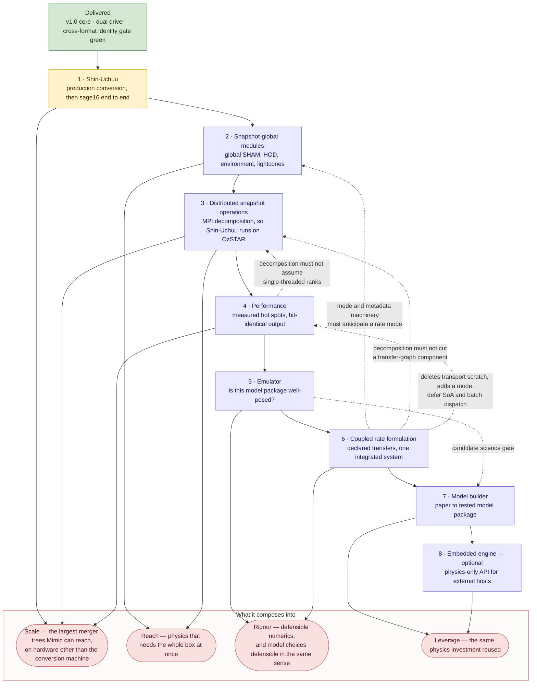

# Mimic Development Pathway

**Status:** Active planning index for `docs/dev/`.
**Date:** 2026-07-02 · last revised 2026-08-20
**Scope:** What is being built, in what order, and which document owns each piece. Current and future work only; everything finished is consolidated in [Completed Work](#completed-work) at the end.

> ### ► NEXT TASK: the Shin-Uchuu subset conversion and rehearsal — needs an operator at the machine
> `POST-PHASE-5-JOINT-REVIEW.md` §6 **item 6**. Every runtime prerequisite is closed and the default-pair suite is green. **No remaining work on step 1's critical path can be done away from the conversion machine** — the remote-safe queue was fully worked on 2026-08-20. The steps 5 and 6 spikes are technically unblocked and touch no core code, but they are sequenced later by choice, not blocked. The source data is located and readable at `/fred/oz214/simulations/uchuu/shinuchuu` on OzSTAR; what remains is a production-scale conversion and memory probe that need an operator physically present. See [Step 1](#step-1-shin-uchuu-in-flight).
>
> Current branch: `feature/ctrees-snapshot-reader`, which merges to `main` once Shin-Uchuu is fully imported.

---

## Purpose

The entry point for active development plans. It answers three questions and delegates everything else: what is being built, in what order, and which document owns the details.

The architectural direction is governed by `docs/VISION.md`: Mimic is a physics-agnostic core with runtime-configurable physics modules, metadata as structural truth, explicit validation, bounded memory, and reproducible output provenance.

---

## The Work In One Picture

Eight pieces remain. Most are worth building on their own — distributed operation is the exception, having nothing to distribute until a snapshot-global contract exists — but the reason to sequence them deliberately is that several are worth considerably more in combination than apart.

**Reading it.** The numbered chain is the **planned order**, not a dependency chain — only one link is a genuine hard dependency, distributed operation needing a snapshot-global contract to exist. The dotted arrows are the couplings that explain why the order is what it is, and **four of them point backwards**: coupled-rate work constrains the design of steps 2, 3 and 4 even though it is scheduled after them, and the performance work constrains step 3's decomposition for the same reason. Those constraints are knowledge rather than code, so they can be honoured in advance — and must be, which is why they are drawn.

**Where the value compounds.** Three couplings are worth more than the sum of their parts, and each is a reason to care about sequencing rather than only about scope:

- **Emulator with model builder.** The builder specifies physical invariants, paper-figure parity and regression against trusted baselines, but its hardest unsolved problem is defining scientific "done" for a *novel* model, where no trusted baseline exists to regress against. The emulator is the only candidate on record for that part of its science-gate layer — a candidate rather than a prerequisite, since a different instrument could satisfy the same precondition.
- **Coupled rate with everything downstream.** A declared, side-effect-free transfer contract is simultaneously what makes the embedded engine's process path tractable, what a paper's equations map onto most directly for the builder, and a better-behaved design vector for the emulator. It is the single interface decision with the widest downstream reach — which is why steps 2, 3 and 4 must be designed knowing it is coming.
- **Snapshot driver with snapshot-global modules.** The driver already makes a whole snapshot population co-resident; without a module contract that can see that population, none of the methods motivating the dual-driver work — global abundance matching, environment, lightcones — are reachable. The scientific payoff is in the pair, not in the driver alone.

Taken together the intended destination is a framework in which a galaxy formation model can be **built from published evidence, tested for identifiability, run at the largest available scale, and compared against alternatives on stated and comparable priors** — each of those backed by recorded evidence rather than by assertion, which is the standard the rest of this repository already holds itself to.

---

## The Ordered Road

**Ordering decided 2026-08-20, and it settles the former A/B question.** Snapshot-global work precedes coupled-rate work, which is the old "Option B". Its recorded cost — the dispatch and metadata machinery being extended twice, the second extension reconciling with the first — is accepted knowingly, because the coupled rate formulation is now treated as **certain rather than contingent**: sequential operator splitting has no defined answer to adjudicate, since permuting a run file's module list changes the result and that ordering carries no physics. Because it is certain, the cost is mitigated by design rather than by sequencing — steps 2, 3 and 4 are built against a known future contract, per the backward arrows above.

| Step | Work | Owned by | Gate or next action |
|---|---|---|---|
| **1** | **Shin-Uchuu** — production conversion and `sage16` end to end | [`SHIN-UCHUU-CONVERSION-PLAN.md`](SHIN-UCHUU-CONVERSION-PLAN.md); checklist at [`POST-PHASE-5-JOINT-REVIEW.md`](POST-PHASE-5-JOINT-REVIEW.md) §6 | See [Step 1](#step-1-shin-uchuu-in-flight). **Blocked on an operator at the conversion machine**, nothing else |
| **2** | **Snapshot-global modules** — the snapshot driver's scientific payoff | [`MIMIC-SNAPSHOT-GLOBAL-MODULES-PLAN.md`](MIMIC-SNAPSHOT-GLOBAL-MODULES-PLAN.md) | Promote to an implementation plan; the first module is a true global SHAM. **Design its mode and metadata machinery as an open set** — it must host a rate mode (step 6) and may need to host a batch mode (step 4), and it is the first work to extend Principle 4's closed list of three, so it owns that amendment |
| **3** | **Distributed snapshot operations** — MPI domain decomposition | [`MIMIC-DISTRIBUTED-SNAPSHOT-PLAN.md`](MIMIC-DISTRIBUTED-SNAPSHOT-PLAN.md) | Needs step 2 to exist first — the one hard dependency in the chain. **Treat the transfer-graph non-cutting rule as binding from the first design sketch** |
| **4** | **Performance** — measured hot spots, bit-identical output | [`OPTIMISATION-SPECTRUM.md`](OPTIMISATION-SPECTRUM.md), on the evidence in [`BENCHMARK-SAGE16-MINI-MILLENNIUM.md`](BENCHMARK-SAGE16-MINI-MILLENNIUM.md) | Promote the spectrum's Tier A to an implementation plan; re-measure before acting (see [Step 4](#step-4-performance)). **Do not introduce a dispatch mode here** — the machinery is step 2's, extended by step 6 |
| **5** | **Emulator** — is a model package well-posed, and what constrains what | [`MIMIC-EMULATOR-PLAN.md`](MIMIC-EMULATOR-PLAN.md) | Run its calibrated-variance spike, outside the product tree entirely |
| **6** | **Coupled rate formulation** — declared transfers, one integrated system | [`MIMIC-COUPLED-RATE-FORMULATION-PLAN.md`](MIMIC-COUPLED-RATE-FORMULATION-PLAN.md) | Run its measurement spike — new files under `models/` only, no core change. The spike sets priority, solver family and the attribution baseline; it is **not** a veto |
| **7** | **Model builder** — paper to tested model package | [`MIMIC-MODEL-BUILDER-PLAN.md`](MIMIC-MODEL-BUILDER-PLAN.md) | Refresh the brief against the tagged v1.0 baseline; its re-review has been due since 2026-08-12 |
| **8** | **Embedded engine** — optional, possibly never | [`MIMIC-EMBEDDED-ENGINE-PLAN.md`](MIMIC-EMBEDDED-ENGINE-PLAN.md) | Nothing depends on it. Promote only if a scientific need arises |

**Why the emulator precedes the coupled rate work.** It is an instrument: built early it can measure everything after it, built late it measures nothing. Concretely, the coupled-rate brief's gate item 5 requires the new package's differences from the control to be quantified, and a point calibration cannot compare two structures on equal footing because each is judged at one hand-tuned operating point.

**Why distributed operation is step 3 rather than later.** Its recorded triggers were a larger simulation or wall-clock pressure. The nearer driver is deployment: Shin-Uchuu is meant to be run by students on OzSTAR, where per-node memory is smaller and work spreads across nodes. Note the boundary — MPI decomposition serves the cluster case, not a single low-memory workstation, where the rehearsal's subset dataset is the relevant artifact instead.

**Why performance is step 4 — after the scale work, before the science instruments.** Three reasons, in decreasing strength.

- **It should be written against the finished scale architecture, not ahead of it.** The dominant hot spot is `execute_phase`, which both drivers share; step 2 extends the dispatch machinery and step 3 changes how ranks divide work. Optimising the dispatcher before those land means optimising a structure about to change, and re-doing the measurement anyway. Note this argument covers the Tier A dispatch work (4.1, 4.2) and **not** thread-per-forest (4.3), which is tree-driver work that steps 2 and 3 do not touch.
- **The coupled-rate work should be written in an optimised state, not the reverse.** It replaces the substep loop wholesale. Landing the cheap core wins first means its measurement spike — a repeated-run exercise — compares solver families against a clean baseline rather than one carrying ~15–25% of removable overhead.
- **It is cheap and self-contained.** Tier A is days-to-weeks of bit-identical work with no vision change and no baseline regeneration, so it can be taken whenever it is convenient without disturbing anything around it.

**What this rationale deliberately does not claim.** An earlier draft argued that emulator campaigns (10²–10³ runs) would multiply any single-run saving. [`MIMIC-EMULATOR-PLAN.md`](MIMIC-EMULATOR-PLAN.md) refutes that: those campaigns "parallelise across cores with no shared state", so a 10³-run campaign at ~3 s over ten cores is minutes, and — more sharply — **thread-per-forest buys a core-saturated campaign nothing at all**, because campaign processes already occupy every core. Step 4 is placed here for the reasons above, not because step 5 needs it.

**Two honest costs of putting it here.**

1. **Tier A would benefit step 1's production Shin-Uchuu runs if taken earlier.** A real forgone gain, accepted deliberately: step 1 is blocked on an operator rather than on wall time, and pulling core changes forward would put an unvalidated dispatcher under the conversion rehearsal, which must certify the *final* runtime.
2. **Step 3 may be reworked by 4.3.** Whether ranks are threaded determines the per-rank memory budget, ghost duplication, the load-balance unit, and the required `MPI_THREAD_*` level — implementation commitments, not knowledge held in reserve. The globals-instancing refactor that item 16 needs is also substantially what a rank-parallel design wants, and it is already half done. **A reviewer argued 4.3 should therefore precede step 3.** The counter-argument is recorded here rather than acted on: the ordering above is a deliberate choice to finish the scale work before opening a concurrency front. If step 3's design sketch finds the thread model genuinely blocking, revisit this rather than working around it.

### Step 1: Shin-Uchuu (in flight)

Work these in order; each step's output is the next step's input.

| # | Work | Why here |
|---|---|---|
| **1.1** | **§6 item 6 — subset conversion + complete rehearsal, creating `simulations/shin-uchuu/` as part of it** ← **blocked on an operator** | The package cannot be completed first: its identity multiplier must come from the conversion report and never from an assumption, its `snapshots/` symlink points at files the conversion has not produced, and `Len`, `Spin` and core `deltaMvir` need calibration from a test run. Its known metadata — particle mass 8.97 × 10⁵ Msun/h, 140 Mpc/h box, `Spin` range `[-1000, 1000]`, the a_list — is in hand; re-measure `sizeof(struct RawHalo)` while there. Subset composition is a hard constraint in its own right — see below. Both models including a full `sage16` pass; output written and read back; the identity gate run on the subset. Instrument it for peak process RSS, `C`, `P`, `G`, the `Spin` extrema, the remaining property ranges, and the writer cost |
| **1.2** | **Close §6 items 2, 3 and 9** from those measurements | `Spin` bounds against measured extrema; memory against measured RSS; ranges calibrated. **If the 85%-of-RAM trigger fires**, implement the compact previous-slab projection — a *runtime* change — and re-run the rehearsal, because the rehearsal must certify the final runtime |
| **1.3** | **§6 item 7 — converter scale-engineering pass (D4)** | The largest remaining item and the last hard blocker on production. Deserves its own frozen implementation plan, scoped from the rehearsal's measurements. Acceptance: the micro-Uchuu battery and topology cross-check re-run green, plus a measured memory profile of the rank pass at projected scale |
| **1.4** | **Full production conversion** — one-time, 5.6 TB → 70 snapshot files | Sets the shin-uchuu identity multiplier from the conversion report's measured counts |
| **1.5** | **Production run + science checks** — `sage16` end to end, then HMF and GSMF at z = 0, 1, 2 | The goal the whole snapshot pathway exists to reach |

**Subset composition decides whether the rehearsal certifies anything.** It must span the earliest snapshots through z=0 and satisfy **both** halves of the D9 design constraint: include the most massive forests **and** a representative low-mass sample. The most massive forests exercise the `Spin` range and the memory ceilings; the low-mass population drives the orphan statistics that set `C` and `G` — which is exactly what a ≈360× finer particle mass changes between micro-Uchuu and Shin-Uchuu. A randomly chosen subset passes while certifying nothing, and a most-massive-only subset measures the ceilings while leaving the ratio unvalidated. `POST-PHASE-5-JOINT-REVIEW.md` D9 owns the constraint.

**Open §6 items.** 2 (`Spin` bounds, provisional until measured), 3 (memory peak and output-population ceiling), 6 (the rehearsal), 7 (converter scale pass), 9 (remaining property ranges), and 10 below. Items 1, 4, 5 and 8 are closed — see [Completed Work](#completed-work). `POST-PHASE-5-JOINT-REVIEW.md` §6 is authoritative for the numbering; `POST-PHASE-5-WORK.md` holds the deferred and non-blocking residue, none of which blocks any of the above.

**§6 item 10 (Uchuu-family particle mass) is deliberately last, and is not a blocker.** Six packages declare 3.25 × 10⁸ Msun/h where the consistent value is 3.27 × 10⁸ — a real correctness defect that moves Uchuu science output through `virial.c:51`. Fixing it re-stamps the committed fixture and the 50-file real micro-Uchuu dataset, and until both agree the header-agreement check aborts every snapshot-format run **including the cross-format identity gate**, which is the regression net the steps above depend on. Its prerequisite was discharged 2026-08-20 (640³ and 2560³ confirmed); full analysis in `POST-PHASE-5-WORK.md` §2.7.

**Where the Shin-Uchuu source data lives.** OzSTAR/Ngarrgu Tindebeek, `ssh dcroton@nt.swin.edu.au`. This is a pointer to the data, not permission to start converting.

| Path under `/fred/oz214/simulations/uchuu/shinuchuu/` | Contents |
|---|---|
| `mergertrees/` | **5.6 TB**, 2,744 `tree_*.dat` ctrees-ASCII files plus `forests.list` and `locations.dat` — the converter's input |
| `halos/` | 42 GB `ShinUchuu_halolist_9p35.h5` |
| `shinuchuu_scalefactor.txt` | 70 scale factors, 0.0477 → 1.0000, in the format the a_list contract wants |
| `shinUchuu_snapshot_redshift_scalefactor.txt` | the same list with snapshot numbers and redshifts, z = 19.9490 → 0.0000 |
| `shinuchuu.par` | the producer's own SAGE parameter file, independently confirming `PartMass 0.0000897`, `BoxSize 140.0`, `Omega 0.3089`, `OmegaLambda 0.6911`, `Hubble_h 0.6774`, `TreeType consistent_trees_ascii`, `LastSnapShotNr 69`, `NumSimulationTreeFiles 2744` |

### Step 4: Performance

[`OPTIMISATION-SPECTRUM.md`](OPTIMISATION-SPECTRUM.md) is the options catalogue — 40 entries, each classified by VISION principle, scientific risk and cost, ordered by expected value. It is **not** a plan, and promoting it needs three things decided.

| # | Work | Why here |
|---|---|---|
| **4.1** | **Re-measure, then promote Tier A to a frozen implementation plan** | The spectrum's own caveat is binding: `-O2` folds static helpers into their translation unit, so per-component totals are trustworthy but per-line attribution inside `execute_phase` is not. Confirm what lives at `module_registry.c:882`, `:870` and `:835` with a dispatch counter before committing to items 1, 2 or 32. Two instruments are missing and cheap: a dispatch counter, and a `--no-output` diagnostic flag |
| **4.2** | **Tier A — items 1–12, 14, 15 (the bit-identical set)** | ~15–25% estimated, days to weeks, no output byte changes, no baseline regeneration, no vision change. Item 13 (build flags: LTO, `-O3`) is **not** in that set — it is possibly FP-perturbing and is promoted separately against the physics baseline. The two largest are the `DEBUG_LOG` gate (4.15% measured) and precomputed mode-partitioned phase plans (33% of inner-loop iterations currently only fail a mode test). Every item must clear the byte-identical physics baseline |
| **4.3** | **Thread-per-forest parallelism** — 6–9× estimated, still bit-identical | The largest bit-identical win available (estimated), with **no unmet precondition**: determinism is already verified (no RNG in the physics path, module `static`s are write-once at `init()`, `GlobalForestOffset` is rank-independent). The blocker is enumerable global mutable state. **Bit-identity is an acceptance criterion here, not a property to check afterwards**: step 5 depends on one parameter set producing exactly one output, and this item introduces threads upstream of it. **Sequence against step 3** — an MPI decomposition designed for single-threaded ranks will be reworked here, which is why the backward arrow exists |
| **4.4** | **Stop, and re-measure before going further** | Tiers B and C past this point are months of work whose value depends on what 4.2 and 4.3 left. SoA and batched dispatch are explicitly deferred — see below |

**Deferred out of this step:** batched dispatch and the SoA generator (spectrum items 17, 19) — the coupled-rate work deletes the transport-scratch state SoA would transpose, and the mode machinery belongs to step 2. See the spectrum's "Read This First".

**Already ruled out, with measurements:** module-major interchange (illegal), static fusion and language changes (they target a ~2% prize), GPU offload at this scale, and substep reduction. See the spectrum's Tier D before re-proposing any of them.

---

## Plan Inventory

Every document in `docs/dev/`. This file is the index itself. (This table was formerly called "Active Plans"; some executed plans still refer to it by that name.)

| Document | Status | Role |
|---|---|---|
| [`SHIN-UCHUU-CONVERSION-PLAN.md`](SHIN-UCHUU-CONVERSION-PLAN.md) | **Open — step 1** | Converter built and micro-Uchuu-validated; the production conversion and the memory-projection fallback trigger remain |
| [`POST-PHASE-5-JOINT-REVIEW.md`](POST-PHASE-5-JOINT-REVIEW.md) | **Open — owns step 1's ordering** | Holistic review of the Phase 5 change set; its §6 is the authoritative pre-Shin-Uchuu checklist, §4 holds decisions D1–D10, §8 records what has landed |
| [`POST-PHASE-5-WORK.md`](POST-PHASE-5-WORK.md) | **Open** | Everything deferred, reported-but-not-fixed, or discovered during Phase 5. §2 is the pre-Shin-Uchuu detail, §3 non-blocking hygiene. **Its §6 ordering is superseded by the joint review's §6** |
| [`MIMIC-SNAPSHOT-GLOBAL-MODULES-PLAN.md`](MIMIC-SNAPSHOT-GLOBAL-MODULES-PLAN.md) | Requirements brief — step 2 | Module contracts over a co-resident snapshot population; prerequisite met 2026-08-12 |
| [`MIMIC-DISTRIBUTED-SNAPSHOT-PLAN.md`](MIMIC-DISTRIBUTED-SNAPSHOT-PLAN.md) | Requirements brief — step 3 | MPI decomposition for snapshot-global operations; blocked on step 2 existing |
| [`OPTIMISATION-SPECTRUM.md`](OPTIMISATION-SPECTRUM.md) | Options catalogue — step 4 | Forty classified optimisation options ordered by expected value; needs promoting to an implementation plan before any of it is built |
| [`BENCHMARK-SAGE16-MINI-MILLENNIUM.md`](BENCHMARK-SAGE16-MINI-MILLENNIUM.md) | Standing evidence | Component-level CPU profile of the default run at `48ffc244`, attributed along VISION boundaries and validated against a differential experiment to 1 percentage point. **Perishable — one machine, one dataset, one commit; re-measure with [`scripts/profiling/`](../../scripts/profiling/) before acting** |
| [`MIMIC-EMULATOR-PLAN.md`](MIMIC-EMULATOR-PLAN.md) | Requirements brief — step 5 | Emulator-based model diagnosis: whether a package is well-posed, and which data constrains which physics |
| [`MIMIC-COUPLED-RATE-FORMULATION-PLAN.md`](MIMIC-COUPLED-RATE-FORMULATION-PLAN.md) | Requirements brief — step 6 | Declared conservative transfers integrated as one coupled system; additive processing mode, existing ABI frozen |
| [`MIMIC-MODEL-BUILDER-PLAN.md`](MIMIC-MODEL-BUILDER-PLAN.md) | Requirements brief — step 7 | Assisted, gate-driven model-package construction from scientific evidence |
| [`MIMIC-EMBEDDED-ENGINE-PLAN.md`](MIMIC-EMBEDDED-ENGINE-PLAN.md) | Requirements brief — step 8, optional | Physics-only API for external hosts |
| [`SNAPSHOT-HDF5-FORMAT.md`](SNAPSHOT-HDF5-FORMAT.md) | **Frozen contract** | The snapshot-ordered input format, `format_version = 1`, with its own versioning ratchet |
| [`SAGE16-PRESCRIPTION-CLASSIFICATION.md`](SAGE16-PRESCRIPTION-CLASSIFICATION.md) | Standing evidence | All 18 `sage16` prescriptions classified rate/jump/algebraic/forcing; settled the coupled-rate brief's Open Question 1 |
| [`MIMIC-DUAL-DRIVER-PLAN.md`](MIMIC-DUAL-DRIVER-PLAN.md) | Executed | Phases 0–5 all done; owns the cross-format identity gate. Archive candidate once Shin-Uchuu lands |
| [`MIMIC-SNAPSHOT-DRIVER-PLAN.md`](MIMIC-SNAPSHOT-DRIVER-PLAN.md) | Executed | The eleven-slice Phase 5 implementation plan. Archive candidate once Shin-Uchuu lands |
| [`SNAPSHOT-OUTPUT-PARTITIONING-PLAN.md`](SNAPSHOT-OUTPUT-PARTITIONING-PLAN.md) | Executed | D5(a): one HDF5 partition per requested output snapshot on the snapshot path. Archive candidate once Shin-Uchuu lands |
| [`D8-SPIN-UNITS-RECONCILIATION-PLAN.md`](D8-SPIN-UNITS-RECONCILIATION-PLAN.md) | Executed and closed | `Spin` relabelled as specific angular momentum across all eight packages. Archive candidate once Shin-Uchuu lands |
| [`D8-FOLLOWUP-RECONCILIATION-PLAN.md`](D8-FOLLOWUP-RECONCILIATION-PLAN.md) | Executed and closed | Reconciled the baseline format-version expectation D8 left mismatched; added an unconditional dimension guard to `convert_unit_scalar()`. Archive candidate once Shin-Uchuu lands |

---

## Source-Of-Truth Boundaries

- `docs/VISION.md` owns architectural principles and should change only when implemented behaviour justifies a narrow vision update.
- Active plan files own implementation scope, acceptance criteria, risk gates, and validation commands.
- `docs/DEVELOPER-GUIDE.md`, `docs/USER-GUIDE.md`, package READMEs, and `.agents/skills/` own durable user/developer instructions after a plan lands.
- `archive/dev-plans/` owns historical records and closeouts. Do not mine it as current instruction unless an active plan explicitly cites it.
- Generated files remain generated; metadata YAML and generator scripts are the editable sources of structural truth.

---

## Standing Constraints

- Do not retain backwards-compatibility code for replaced pre-v1.0 behaviours unless the active plan explicitly says the behaviour remains live.
- Keep `input.tree_type` as the reader-format selector and `input.processing_order` as the processing-driver selector. Do not overload one with the other.
- Keep ctrees ASCII as a live supported tree-ordered reader; the micro-Uchuu identity fixture and the converter's reference semantics depend on it.
- Preserve the ordinary physics-module ABI unless a future approved plan explicitly changes it.
- Keep output identity deterministic across MPI task counts and, for the dual-driver work, across equivalent tree-ordered and snapshot-ordered inputs (per-`UniqueGalaxyID` equality, not byte equality).
- Snapshot-ordered input has strictly adjacent links as a format invariant; Mimic validates and aborts, never repairs. Phantom halos are Consistent-Trees' job and are already present in ctrees data.
- Treat failing tests, generated-code drift, docs-link failures, and validation failures as real release blockers.

---

## Completed Work

Mimic v1.0 is tagged and released from `main` as the first production baseline. What has landed since, in order. Detail lives in the owning documents and in `archive/dev-plans/`; this is the index, not the record.

| Date | What landed |
|---|---|
| 2026-07-18 | **Snapshot-HDF5 format contract frozen** at [`SNAPSHOT-HDF5-FORMAT.md`](SNAPSHOT-HDF5-FORMAT.md), `format_version = 1` |
| 2026-07-24 | **Converter built** under `scripts/convert/` and validated end to end on real micro-Uchuu ASCII — 22,580,924 halos, 50 snapshots, 440,651 forests. The topology-order gate was fully discharged by an exhaustive per-halo cross-check against the tree-ordered reader |
| 2026-08-03 | **Converted dataset regenerated and re-gated** rather than assumed, because the Python stack had moved. All three totals reproduced exactly; producer battery 15/15; cross-check green including `topology-chains` |
| 2026-08-04 | **Snapshot reader** (dual-driver Phase 4b): the `micro-uchuu-snapshot` fixture package, `struct SnapshotReader` with its own registry under `src/io/snapshot/`, and startup wiring resolving `input.tree_type` against both registries |
| 2026-08-10 | **Pre-Phase-5 work**: the `UniqueGalaxyID` description defect corrected everywhere it had propagated, the `.git/HEAD` worktree build fix, and a sweep of package-dependent "default" test assertions. An independent readiness review returned PASS WITH RISKS, no P0/P1 |
| 2026-08-12 | **Snapshot driver + cross-format identity gate** (Phase 5, eleven slices). For every output snapshot, aggregated across every partition, both drivers produce identical `UniqueGalaxyID` sets and per-ID bitwise-equal fields, with no tolerance — under both models and both timestep schemes. The tree path stayed byte-identical at the galaxy-record level. The gate is package-local to `micro-uchuu-snapshot` and is a **manual, dataset-present operation**; no automated tier runs it. Mechanics in `docs/DEVELOPER-GUIDE.md` → "The cross-format identity gate" |
| 2026-08-13 | **Snapshot output partitioning** (D5(a)): one HDF5 partition per requested output snapshot, certified by an 8/8-stage identity-gate re-run on the real dataset |
| 2026-08-14 | **`Spin` units reconciliation** (D8) across all eight packages, with `Spin` values proved byte-identical and only the label changed; plus its follow-up restoring a green default-pair suite and closing a pre-existing dimension-checking gap in `convert_unit_scalar()` |
| 2026-08-19/20 | **Remote-safe queue fully worked**: run-profile instrumentation reporting peak RSS and the `C`/`P`/`G` terms; micro/mini-Uchuu particle counts sourced; identity-gate test coverage that existed only as run evidence committed; all 18 `sage16` prescriptions classified |
| 2026-08-20 | **Default run profiled and an optimisation spectrum recorded**: a component-level CPU breakdown attributed along VISION boundaries ([`BENCHMARK-SAGE16-MINI-MILLENNIUM.md`](BENCHMARK-SAGE16-MINI-MILLENNIUM.md)), validated top-down against a differential experiment to 1 percentage point, and 40 classified optimisation options ordered by expected value ([`OPTIMISATION-SPECTRUM.md`](OPTIMISATION-SPECTRUM.md)). Scheduled as the new step 4; no code changed |
| 2026-08-20 | **Shin-Uchuu source data located** on OzSTAR, retiring half of item 6's recorded blocker. **Emulator brief written**, and this pathway restructured around a decided ordered sequence. **Prior-art framing and two assessed-but-not-adopted options recorded** in the coupled-rate brief, with a reionization qualification added to the snapshot-global brief — decision context for their implementation plans, not scope |

**Archive policy.** Completed plans move out of `docs/dev/` to `archive/dev-plans/` (gitignored local history); durable instructions live in the guides, the frozen format spec, package READMEs, the skills, and the code. Already archived: `chunked-output-plan.md`, `MIMIC-CONVERTER-IMPLEMENTATION-PLAN.md`, `MIMIC-SNAPSHOT-READER-PLAN.md`, `PHASE-4B-REVIEW-AND-PRE-PHASE-5-WORK.md`, `PRE-PHASE-5-READINESS-REVIEW.md`, and `dual-driver-plan-review.md`. The reader plan's four still-live deferred entries survive its archival in `MIMIC-DUAL-DRIVER-PLAN.md`'s Phase 5 follow-up notes. Archived material is historical evidence, not active planning input.

**History decision: `f81e2385` is not squashed into `13c0c9a7`.** Decided 2026-08-14; do not revisit without new evidence. D8 Slice 2 landed and was then *stopped rather than accepted* because it left the default integration suite red; `13c0c9a7` restored it. Flattening was rejected on three grounds. **Provenance** settles it alone: `f81e2385` is cited by SHA in eight places across five documents here, and squashing turns every citation into a pointer to a commit that does not exist. **Mechanics**: the two are not adjacent, so this would be a history reorder rather than a neighbour fixup, against the standing rule on amending landed commits. **Scientific record**: the commit boundary is the primary evidence for a lesson now in `.agents/skills/mimic-validation-and-qa` — run the full suite as the *last* action, because the parent plan's ordering ran it before the baseline refresh and so never tested its own final tree. The accepted cost is that `git bisect` can land on a red tree for exactly two commits; `git bisect skip` covers it. If branch history ever needs to read more cleanly, narrate the arc in the merge commit rather than rewriting the commits.
