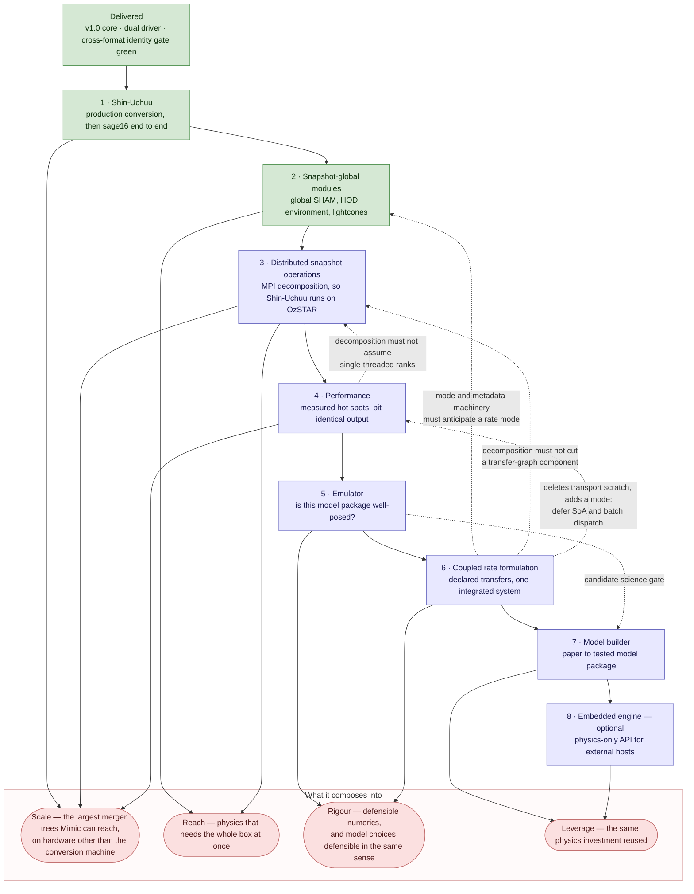

# Mimic Development Pathway

**Status:** Active planning index for `docs/dev/`.
**Date:** 2026-07-02 · **last revised 2026-10-03** to record snapshot-global modules (step 2) as complete with residuals; the 2026-09-30 revision was the v1.2 release preparation: the completed plans were archived, `docs/dev/` was decoupled from the rest of the repository, and the recorded residuals and the version 3 Shin-Uchuu and full-Uchuu follow-up were written down here. Historical measured outcomes remain under [Completed Work](#completed-work).
**Scope:** What is being built, in what order, and which document owns each piece. Current and future work only; everything finished is consolidated in [Completed Work](#completed-work) at the end.

> ### ► CURRENT FOCUS: no step is in execution; roadmap step 2, snapshot-global modules, is complete with recorded residuals, and the next choice is the owner's
> **v1.2 was released from `converter-generalisation-mode-b`** on 2026-09-30 (see [Completed Work](#completed-work)); the root `CHANGELOG.md` records what v1.2 changes and what it claims. Mimic reads and runs horizontal-HDF5 version 3 on the routes its parity gates passed; full Uchuu is not runnable until [chunked slab streaming](MIMIC-CHUNKED-SLAB-STREAMING-PLAN.md) exists.
>
> **Roadmap step 2 (snapshot-global modules) was implemented and accepted on 2026-10-03.** [`MIMIC-SNAPSHOT-GLOBAL-MODULES-PLAN.md`](MIMIC-SNAPSHOT-GLOBAL-MODULES-PLAN.md) ran as five Mode B slices: a typed `process_snapshot` callback and metadata, an ordered `modules.post_snapshot` phase in the horizontal driver, the opt-in `sham_global_rank` module, the explicit fixture and disabled-mode acceptance gates, and this documentation closeout. [`MIMIC-SNAPSHOT-GLOBAL-MODULES-ACCEPTANCE.md`](MIMIC-SNAPSHOT-GLOBAL-MODULES-ACCEPTANCE.md) records the measured evidence: every gate passed except Stage 8 of the `micro-uchuu-ascii-horizontal` real-data gate, a failure that predates the feature (it reproduces at the pre-feature reference commit) and that the owner ruled out of scope for this increment on 2026-10-03; it is a named follow-up, not a feature regression. The increment is single-process with fully resident snapshots, `sham_global_rank` is an uncalibrated framework demonstration, and no production-scale global-run memory or observational validation was measured. **Distributed operation (step 3) and chunked slab streaming remain separate future work.** The permanent contract lives in the [VISION](../VISION.md), the [user guide](../USER-GUIDE.md#snapshot-wide-modules) and the [developer guide](../DEVELOPER-GUIDE.md#snapshot-callback-contract). The plan is still in `docs/dev/` unedited; archiving it, after fixing the identity-test reference derivation (see [Recorded residuals](#recorded-residuals-documented-not-scheduled)), is the owner's later action.
>
> **The other candidates remain open and unscheduled**: chunked slab streaming ([`MIMIC-CHUNKED-SLAB-STREAMING-PLAN.md`](MIMIC-CHUNKED-SLAB-STREAMING-PLAN.md), needed for full Uchuu, bounded memory on large snapshots and the [version 3 conversions](#named-follow-up-version-3-conversions-of-shin-uchuu-and-full-uchuu)); output provenance for version 3 inputs; and `sage16` gates for the four `halos-only` routes (whole-simulation `halos-only` evidence for Millennium and mini-Uchuu was recorded on 2026-10-02; see [Completed Work](#completed-work)). What is documented but not scheduled is under [Recorded residuals](#recorded-residuals-documented-not-scheduled).
---

## Purpose

The entry point for active development plans. It answers three questions and delegates everything else: what is being built, in what order, and which document owns the details.

The architectural direction is governed by `docs/VISION.md`: Mimic is a physics-agnostic core with runtime-configurable physics modules, metadata as structural truth, explicit validation, bounded memory, and reproducible output provenance.

---

## The Work In One Picture

Six pieces remain, steps 3 to 8 (steps 1 and 2 are complete; step 2 landed on 2026-10-03 and stays in the diagram because its couplings still constrain the later steps). Most are worth building on their own — distributed operation was the exception, having nothing to distribute until a snapshot-global contract exists — but the reason to sequence them deliberately is that several are worth considerably more in combination than apart.

```mermaid
flowchart TD
    DONE["Delivered<br/>v1.0 core · dual driver · cross-format identity gate green"]

    S1["1 · Shin-Uchuu<br/>production conversion, then sage16 end to end"]
    S2["2 · Snapshot-global modules<br/>global SHAM, HOD, environment, lightcones"]
    S3["3 · Distributed snapshot operations<br/>MPI decomposition, so Shin-Uchuu runs on OzSTAR"]
    S4["4 · Performance<br/>measured hot spots, bit-identical output"]
    S5["5 · Emulator<br/>is this model package well-posed?"]
    S6["6 · Coupled rate formulation<br/>declared transfers, one integrated system"]
    S7["7 · Model builder<br/>paper to tested model package"]
    S8["8 · Embedded engine — optional<br/>physics-only API for external hosts"]

    subgraph VALUE["What it composes into"]
        VSCALE(["Scale — the largest merger trees Mimic can reach,<br/>on hardware other than the conversion machine"])
        VREACH(["Reach — physics that needs the whole box at once"])
        VRIGOUR(["Rigour — defensible numerics,<br/>and model choices defensible in the same sense"])
        VLEVER(["Leverage — the same physics investment reused"])
    end

    DONE --> S1 --> S2 --> S3 --> S4 --> S5 --> S6 --> S7 --> S8

    S6 -.->|mode and metadata machinery<br/>must anticipate a rate mode| S2
    S6 -.->|decomposition must not cut<br/>a transfer-graph component| S3
    S6 -.->|deletes transport scratch, adds a mode:<br/>defer SoA and batch dispatch| S4
    S4 -.->|decomposition must not assume<br/>single-threaded ranks| S3
    S5 -.->|candidate science gate| S7

    S1 --> VSCALE
    S3 --> VSCALE
    S4 --> VSCALE
    S2 --> VREACH
    S3 --> VREACH
    S5 --> VRIGOUR
    S6 --> VRIGOUR
    S7 --> VLEVER
    S8 --> VLEVER

    classDef done fill:#d5e8d4,stroke:#478c47,color:#12300f
    classDef step fill:#e8e8ff,stroke:#6a6ac0,color:#1c1c4d
    classDef flight fill:#fff2cc,stroke:#c8a415,color:#3d3000
    classDef value fill:#fbe0e0,stroke:#c06a6a,color:#4d1c1c
    class DONE done
    class S1,S2 done
    class S3,S4,S5,S6,S7,S8 step
    class VSCALE,VREACH,VRIGOUR,VLEVER value

    style VALUE fill:#fffafa,stroke:#c06a6a
```

**Reading it.** The numbered chain is the **planned order**, not a dependency chain — only one link is a genuine hard dependency, distributed operation needing a snapshot-global contract to exist. The dotted arrows are the couplings that explain why the order is what it is, and **four of them point backwards**: coupled-rate work constrains the design of steps 2, 3 and 4 even though it is scheduled after them, and the performance work constrains step 3's decomposition for the same reason. Those constraints are knowledge rather than code, so they can be honoured in advance — and must be, which is why they are drawn.

**Where the value compounds.** Three couplings are worth more than the sum of their parts, and each is a reason to care about sequencing rather than only about scope:

- **Emulator with model builder.** The builder specifies physical invariants, paper-figure parity and regression against trusted baselines, but its hardest unsolved problem is defining scientific "done" for a *novel* model, where no trusted baseline exists to regress against. The emulator is the only candidate on record for that part of its science-gate layer — a candidate rather than a prerequisite, since a different instrument could satisfy the same precondition.
- **Coupled rate with everything downstream.** A declared, side-effect-free transfer contract is simultaneously what makes the embedded engine's process path tractable, what a paper's equations map onto most directly for the builder, and a better-behaved design vector for the emulator. It is the single interface decision with the widest downstream reach — which is why steps 2, 3 and 4 must be designed knowing it is coming.
- **Horizontal driver with snapshot-global modules.** The driver already makes a whole snapshot population co-resident; without a module contract that can see that population, none of the methods motivating the dual-driver work — global abundance matching, environment, lightcones — are reachable. The scientific payoff is in the pair, not in the driver alone.

Taken together the intended destination is a framework in which a galaxy formation model can be **built from published evidence, tested for identifiability, run at the largest available scale, and compared against alternatives on stated and comparable priors** — each of those backed by recorded evidence rather than by assertion, which is the standard the rest of this repository already holds itself to.

---

## The Ordered Road

**Ordering decided 2026-08-20, and it settles the former A/B question.** Snapshot-global work precedes coupled-rate work, which is the old "Option B". Its recorded cost — the dispatch and metadata machinery being extended twice, the second extension reconciling with the first — is accepted knowingly, because the coupled rate formulation is now treated as **certain rather than contingent**: sequential operator splitting has no defined answer to adjudicate, since permuting a run file's module list changes the result and that ordering carries no physics. Because it is certain, the cost is mitigated by design rather than by sequencing — steps 2, 3 and 4 are built against a known future contract, per the backward arrows above.

| Step | Work | Owned by | Gate or next action |
|---|---|---|---|
| **1** | **Shin-Uchuu** — production conversion and `sage16` end to end | Closed. The production record is [`simulations/shin-uchuu/README.md`](../../simulations/shin-uchuu/README.md#how-the-production-dataset-was-made); converter operation is in [`convert/mimic-convert/README.md`](../../convert/mimic-convert/README.md). The design plan (P1–P9), the flyby-defect addendum (R1–R15) and the Phase 5 review and work lists are archived as `SHIN-UCHUU-CONVERSION-PLAN.md`, `SHIN-UCHUU-FLYBY-DEFECT-ADDENDUM.md`, `POST-PHASE-5-JOINT-REVIEW.md` and `POST-PHASE-5-WORK.md` | See [Step 1](#step-1-shin-uchuu-closed). **CLOSED 2026-09-17.** Sub-steps 1.1–1.4 closed earlier; 1.5 reopened by the flyby defect, then closed by the R1–R15 remediation |
| **2** | **Snapshot-global modules** — the horizontal driver's scientific payoff | [`MIMIC-SNAPSHOT-GLOBAL-MODULES-PLAN.md`](MIMIC-SNAPSHOT-GLOBAL-MODULES-PLAN.md), with its checks, review and [acceptance](MIMIC-SNAPSHOT-GLOBAL-MODULES-ACCEPTANCE.md) records beside it | **COMPLETE 2026-10-03, with recorded residuals** (see the current-focus box and [Recorded residuals](#recorded-residuals-documented-not-scheduled)). The first module is `sham_global_rank`, an uncalibrated global rank SHAM demonstration. **Its mode and metadata machinery is an open set** — explicit mode descriptors shared by generator and validator, a typed per-family callback, and no assumption that every non-FoF mode is the snapshot mode — so it can host a rate mode (step 6) and possibly a batch mode (step 4); it owned the amendment of Principle 4's former closed list of three. Single process, fully resident snapshots only |
| **3** | **Distributed snapshot operations** — MPI domain decomposition | [`MIMIC-DISTRIBUTED-SNAPSHOT-PLAN.md`](MIMIC-DISTRIBUTED-SNAPSHOT-PLAN.md) | Step 2 now exists (single process, fully resident snapshots), which discharges the one hard dependency in the chain. **Treat the transfer-graph non-cutting rule as binding from the first design sketch** |
| **4** | **Performance** — measured hot spots, bit-identical output | [`OPTIMISATION-SPECTRUM.md`](OPTIMISATION-SPECTRUM.md), on the evidence in [`BENCHMARK-SAGE16-MINI-MILLENNIUM.md`](BENCHMARK-SAGE16-MINI-MILLENNIUM.md) | Promote the spectrum's Tier A to an implementation plan; re-measure before acting (see [Step 4](#step-4-performance)). **Do not introduce a dispatch mode here** — the machinery is step 2's, extended by step 6 |
| **5** | **Emulator** — is a model package well-posed, and what constrains what | [`MIMIC-EMULATOR-PLAN.md`](MIMIC-EMULATOR-PLAN.md) | Run its calibrated-variance spike, outside the product tree entirely |
| **6** | **Coupled rate formulation** — declared transfers, one integrated system | [`MIMIC-COUPLED-RATE-FORMULATION-PLAN.md`](MIMIC-COUPLED-RATE-FORMULATION-PLAN.md) | Run its measurement spike — new files under `models/` only, no core change. The spike sets priority, solver family and the attribution baseline; it is **not** a veto |
| **7** | **Model builder** — paper to tested model package | [`MIMIC-MODEL-BUILDER-PLAN.md`](MIMIC-MODEL-BUILDER-PLAN.md) | Refresh the brief against the tagged v1.0 baseline; its re-review has been due since 2026-08-12 |
| **8** | **Embedded engine** — optional, possibly never | [`MIMIC-EMBEDDED-ENGINE-PLAN.md`](MIMIC-EMBEDDED-ENGINE-PLAN.md) | Nothing depends on it. Promote only if a scientific need arises |

**Owner-selected focus before step 2: converter generalisation, then the general horizontal runtime — both executed.** Converter generalisation added three source adapters — L-Halo binary, Consistent-Trees forests-HDF5 and the existing ASCII converter — and a new lossless format contract, version 3, rather than column configuration alone, because inspection found real skipped-snapshot links in mini-Millennium and full Uchuu's documented size exceeds the int32 snapshot bound. It executed and closed under Mode B (all 12 slices accepted, final commit `cb2e0ffc`). Its result was conversion *routes*, not runnable simulations, until the general horizontal runtime made the gated routes runnable (both plans, their acceptance records and their post-run reviews are archived; the archive policy under [Completed Work](#completed-work) names them). Full Uchuu is storage-bound rather than merely unmounted: ≈25.7 TB of output at the measured large-snapshot rate (an extrapolation from the package README's unverified total) plus ≈79 TB of workdir and ≈85 TB of transient spill, against ≈8.4 TB free on this host (measured 2026-09-22). The numbered long-term roadmap below is otherwise unchanged.

**A second candidate, needing no prerequisite step at all: chunked slab streaming.** [`MIMIC-CHUNKED-SLAB-STREAMING-PLAN.md`](MIMIC-CHUNKED-SLAB-STREAMING-PLAN.md) is likewise a concept note, not a committed step — unnumbered, absent from the mermaid diagram, not among the six remaining pieces. It surfaced from P5's real memory finding on the Shin-Uchuu production run (see [Step 1](#step-1-shin-uchuu-closed) below): the horizontal driver's peak memory scales linearly with the halo count of its single largest slab, uncapped, and today's only specified mitigation (the compact previous-slab projection) closes barely a tenth of the gap at Shin-Uchuu's actual production scale. Unlike the converter-generalisation note, this one needs no sequencing decision relative to step 2 — it is a raw driver memory bound, orthogonal to which physics modules run or whether MPI is in play, so it could in principle be picked up whenever it is convenient rather than waiting on anything else in this table. It is **more load-bearing than a passive future idea**: the owner has stated a firm intent to run Shin-Uchuu (and larger future simulations) repeatedly, including eventually on a single local machine, so the NT-relocation that unblocked today's run is explicitly a stopgap, not a substitute for this. Promote it to a requirements brief when it is time to flesh it out fully.

**Why the emulator precedes the coupled rate work.** It is an instrument: built early it can measure everything after it, built late it measures nothing. Concretely, the coupled-rate brief's gate item 5 requires the new package's differences from the control to be quantified, and a point calibration cannot compare two structures on equal footing because each is judged at one hand-tuned operating point.

**Why distributed operation is step 3 rather than later.** Its recorded triggers were a larger simulation or wall-clock pressure. The nearer driver is deployment: Shin-Uchuu is meant to be run by students on OzSTAR, where per-node memory is smaller and work spreads across nodes. Note the boundary — MPI decomposition serves the cluster case, not a single low-memory workstation, where the rehearsal's subset dataset is the relevant artifact instead.

**Why performance is step 4 — after the scale work, before the science instruments.** Three reasons, in decreasing strength.

- **It should be written against the finished scale architecture, not ahead of it.** The dominant hot spot is `execute_phase`, which both drivers share; step 2 extends the dispatch machinery and step 3 changes how ranks divide work. Optimising the dispatcher before those land means optimising a structure about to change, and re-doing the measurement anyway. Note this argument covers the Tier A dispatch work (4.1, 4.2) and **not** thread-per-forest (4.3), which is vertical-driver work that steps 2 and 3 do not touch.
- **The coupled-rate work should be written in an optimised state, not the reverse.** It replaces the substep loop wholesale. Landing the cheap core wins first means its measurement spike — a repeated-run exercise — compares solver families against a clean baseline rather than one carrying ~15–25% of removable overhead.
- **It is cheap and self-contained.** Tier A is days-to-weeks of bit-identical work with no vision change and no baseline regeneration, so it can be taken whenever it is convenient without disturbing anything around it.

**What this rationale deliberately does not claim.** An earlier draft argued that emulator campaigns (10²–10³ runs) would multiply any single-run saving. [`MIMIC-EMULATOR-PLAN.md`](MIMIC-EMULATOR-PLAN.md) refutes that: those campaigns "parallelise across cores with no shared state", so a 10³-run campaign at ~3 s over ten cores is minutes, and — more sharply — **thread-per-forest buys a core-saturated campaign nothing at all**, because campaign processes already occupy every core. Step 4 is placed here for the reasons above, not because step 5 needs it.

**Two honest costs of putting it here.**

1. **Tier A would benefit step 1's production Shin-Uchuu runs if taken earlier.** A real forgone gain, accepted deliberately: step 1 is blocked on an operator rather than on wall time, and pulling core changes forward would put an unvalidated dispatcher under the conversion rehearsal, which must certify the *final* runtime.
2. **Step 3 may be reworked by 4.3.** Whether ranks are threaded determines the per-rank memory budget, ghost duplication, the load-balance unit, and the required `MPI_THREAD_*` level — implementation commitments, not knowledge held in reserve. The globals-instancing refactor that item 16 needs is also substantially what a rank-parallel design wants, and it is already half done. **A reviewer argued 4.3 should therefore precede step 3.** The counter-argument is recorded here rather than acted on: the ordering above is a deliberate choice to finish the scale work before opening a concurrency front. If step 3's design sketch finds the thread model genuinely blocking, revisit this rather than working around it.

### Named follow-up: Version 3 conversions of Shin-Uchuu and full Uchuu

**Placed after chunked slab streaming on the road, and actionable only after chunked slab streaming lands.** Scoped by the owner on 2026-09-29, in this order:

1. **Gate an ASCII-source version 3 route at micro-Uchuu scale first**: a version 3 conversion of `micro-uchuu-ascii` with its schema test and parity gate, replacing the version 2 `micro-uchuu-ascii-horizontal` package in place if the version 2 path is retired. No version 3 route from a Consistent-Trees ASCII source has been gated.
2. **Profile and package Shin-Uchuu**: a `simulations/shin-uchuu-ascii/converter_columns.yaml` profile and a Shin-Uchuu version 3 package with its schema test and gate.
3. **Re-derive the storage envelope from a rehearsal** on the local retained 406,668,896-halo subset (a measured L-Halo data point now exists for scale: 1,451,359,554 halos converted in about 4 h with a 628 GB workdir and a 678 GB transpose spill, though the ASCII route differs). Linear extrapolation from the measured 181 M-halo mini-Uchuu conversion gives one to two weeks of conversion, about 10 TB of workdir without consumptive deletion and about 3.2 TB of output, plus the 11.61 TB source copy.
4. **Plan for NT-class memory until streaming exists**: version 3 widens each halo by about 40 B, about 12.6 GB per retained generation at Shin-Uchuu's largest slab.
5. **Full Uchuu additionally** needs its about 37 TB source mounted and about 26 TB of output.

**A further step after that: retire the version 2 path.** About 12–14 k lines, three quarters of them tests, fixtures and prose. Its preconditions are a Shin-Uchuu version 3 dataset; a gated ASCII-source version 3 route that inherits the version 2 gate's role, including its vertical-path preservation stage; and the version 2 reader's negative battery mapped onto `tests/unit/test_horizontal_v3_reader.c`.

### Step 1: Shin-Uchuu (closed)

Work these in order; each step's output is the next step's input. **All of 1.1 through 1.5 are closed.** The plans this section names (`SHIN-UCHUU-CONVERSION-PLAN.md`, `SHIN-UCHUU-FLYBY-DEFECT-ADDENDUM.md`, `POST-PHASE-5-JOINT-REVIEW.md`, `POST-PHASE-5-WORK.md`) are archived; the durable production record is `simulations/shin-uchuu/README.md`. 1.5 executed as steps P3b–P9 of `SHIN-UCHUU-CONVERSION-PLAN.md` → "The Production Execution Sequence" (P1–P3), then as the R1–R15 flyby-defect remediation once P8 reopened it.

| # | Work | Status, and why here |
|---|---|---|
| **1.1** | ~~**§6 item 6 — subset conversion + complete rehearsal, creating `simulations/shin-uchuu/` and `simulations/shin-uchuu-ascii/` as part of it**~~ | **CLOSED 2026-08-26.** A whole-forest subset was selected with `convert/mimic-convert/subset.py`, converted, and exercised end to end at **406,668,896 halos** under both `halos-only` and `sage16`, instrumented for peak RSS, `C`, `P`, `G`, the `Spin` extrema, the remaining property ranges and the writer cost. The package could not be completed first: its identity multiplier must come from the conversion report and never from an assumption, its `snapshots/` symlink points at files the conversion had not produced, and `Len`, `Spin` and core `deltaMvir` needed calibration from a real run. The one thing it could not do — the percolation super-forest is excluded, because the vertical driver cannot load it (C5/C6) — is a carry-forward, and is why the production `Spin` scan (P4) is binding rather than a formality |
| **1.2** | ~~**Close §6 items 2, 3 and 9** from those measurements~~ | **CLOSED 2026-08-26.** `Spin` `[-1000, 1000]` not refuted (measured `[-11.673591, +17.797567]` over all 406,668,896 halos); `Vmax`'s inherited floor corrected to `[0.0, 5000.0]` in both packages; the population check clear at `P`/N = 0.99701; memory closed on measured peak RSS, projecting ≈476.6 GB. The 85%-of-RAM trigger was crossed and the compact previous-slab projection was **deferred by owner decision**, conditional on item 11's seed headroom, which landed |
| **1.3** | ~~**§6 item 7 — converter scale-engineering pass (D4)**~~ | **CLOSED 2026-08-28.** Nine slices, landed as `184424df`…`b2ae9601` plus `0ab453fe` early, under its own frozen implementation plan (complete and archived). Its acceptance gate ran green on a **fresh** micro-Uchuu conversion the rebuilt converter itself produced: producer battery 15/15, topology cross-check 8/8, zero unexplained mismatches, plus rehearsal-scale memory profiles for `links`, the battery and the cross-check. Record: `SHIN-UCHUU-CONVERSION-PLAN.md` → "Pass complete" |
| **1.4** | ~~**Full production conversion** — one-time, 11.61 TB → 70 snapshot files~~ | **CLOSED 2026-09-03.** Steps **P1–P3** of the execution sequence, executed and measured: **22,503,649,037 halos**, **2.2520 TB** emitted across 70 snapshot files plus `forests.h5` — the snapshot files alone are 2.2507 TB = 100.01 B/halo — within 2.5% of the ≈2.31 TB pre-run projection (the "2.0 TB" first recorded here was a macOS `du -sh` TiB/TB unit error, corrected 2026-09-09). `unique_galaxy_id_multiplier: 20000000000` set and committed (`5506ef88`). Record: `SHIN-UCHUU-CONVERSION-PLAN.md` → "Production run complete" |
| **1.5** | **Production run + science checks** — `sage16` end to end, then HMF and GSMF at z = 0, 1, 2 | **CLOSED 2026-09-17.** P6 succeeded 2026-09-07 (job `16267967`, 472.3 GB peak RSS, 17h04m43s, ≈543.4 GB output); P7 passed 2026-09-08. **P8's science check then failed on its first figure** — `BaryonFraction` reached 0.35 against a cosmic 0.17. Root cause `fix_flybys()`: 33.0% of the z=0 galaxy population was in one bogus FoF group, confined to snapshot 69. **Remediated end to end (R1–R15)**: `fix_flybys` deleted, format bumped to `format_version = 2`, fix verified on micro-Uchuu across all three readers (R1–R7, committed `a654c228`+`5005cd49`); Shin-Uchuu re-converted to v2 (5d18h35m, R8+R9) and re-pointed (R10); `sage16` re-run locally on the corrected dataset (9h35m, 513.0 GB peak RSS, R12) and all four science acceptance criteria passed **exactly** against their predicted targets, including an exact match on the z=0 Type-0 count (244,953,607) and the full six-bin halo mass function (R13); v1 artefacts retired to named archive locations, nothing deleted (R14); NT and local cleanup, Definition of Done (0–11) confirmed in full (R15). Full record: `SHIN-UCHUU-FLYBY-DEFECT-ADDENDUM.md`. P6/P7's original measurements stand as evidence the pipeline works at this scale; their v1 science output is void and has been superseded by v2's. The durable generic memory fix remains separate and unstarted: [`MIMIC-CHUNKED-SLAB-STREAMING-PLAN.md`](MIMIC-CHUNKED-SLAB-STREAMING-PLAN.md) |

**Re-running the Shin-Uchuu conversion.** The command sequence with every flag it depends on, the storage envelope and the memory term are in [`simulations/shin-uchuu/README.md`](../../simulations/shin-uchuu/README.md#how-the-production-dataset-was-made) → "How the production dataset was made"; the converter's general behaviour (resume semantics, `--pool-size`, consumptive deletion, batch mode) is in [`convert/mimic-convert/README.md`](../../convert/mimic-convert/README.md); [`HORIZONTAL-HDF5-FORMAT.md`](../../convert/mimic-convert/HORIZONTAL-HDF5-FORMAT.md) is the output contract. For build, environment and test mechanics use the project-local skills named in `.claude/CLAUDE.md`. The conversion phases and the production run all exceed any short command timeout: run them detached and poll.

**Subset selection was designed 2026-08-25 and was the rehearsal's first task; it is built and was used.** The composition constraint below had been stated in four places and operationalised in none; `SHIN-UCHUU-CONVERSION-PLAN.md` → "Subset Selection and Extraction" specifies the whole route — rank forests by size from `forests.list` + `locations.dat` alone (21.3 GB), sample one root row per candidate tree remotely to get exact masses (~1 GB of scattered reads), select a random stratum plus a high-mass supplement, extract whole forests by streaming byte ranges on the data node, and verify before transferring. The bulk 11.61 TB is never read for selection. It is built, as `convert/mimic-convert/subset.py`, whose module docstring documents its constraints.

**Subset composition decided whether the rehearsal certified anything, and this is the constraint the executed subset was built to.** It had to span the earliest snapshots through z=0 and satisfy **both** halves of the D9 design constraint: include the most massive forests **and** a representative low-mass sample. The most massive forests exercise the `Spin` range and the memory ceilings; the low-mass population drives the orphan statistics that set `C` and `G` — which is exactly what a ≈360× finer particle mass changes between micro-Uchuu and Shin-Uchuu. A randomly chosen subset passes while certifying nothing, and a most-massive-only subset measures the ceilings while leaving the ratio unvalidated. `POST-PHASE-5-JOINT-REVIEW.md` D9 owns the constraint.

**All §6 items are now closed.** Items 1, 4, 5 and 8 closed earlier; **2, 3, 6 and 9 closed 2026-08-26** from the rehearsal's measurements; **11 closed 2026-08-26** (the output-buffer seed headroom, at a 5% seed); **7 closed 2026-08-28** (the converter scale pass); **10 closed 2026-09-17 as F1** (the Uchuu-family particle mass). `POST-PHASE-5-JOINT-REVIEW.md` §6 is authoritative for the numbering; `POST-PHASE-5-WORK.md` §6 holds the same table plus **"Carried into the production run"** — the obligations those closures themselves created, which the execution sequence's P4 and P5 discharge. Neither document's non-blocking residue blocks any of the above.

**§6 item 10 (Uchuu-family particle mass), closed 2026-09-17 as F1.** Six packages declared 3.25 × 10⁸ Msun/h where the consistent value is 3.27 × 10⁸ — a real correctness defect that moved Uchuu science output through `virial.c:51`. The fix re-stamped the committed fixture and the real 50-file micro-Uchuu dataset, keeping both sides of the header-agreement check in agreement so the cross-format identity gate and every horizontal-format run stay green. Its prerequisite was discharged 2026-08-20 (640³ and 2560³ confirmed); full analysis and closure record in `POST-PHASE-5-WORK.md` §2.7.

**Where the Shin-Uchuu source data lives.** OzSTAR/Ngarrgu Tindebeek, `ssh dcroton@nt.swin.edu.au`. This is a pointer to the data, not permission to start converting.

| Path under `/fred/oz214/simulations/uchuu/shinuchuu/` | Contents |
|---|---|
| `mergertrees/` | **11.61 TB apparent** (5.6 TB as `du` reports it), 2,744 `tree_*.dat` ctrees-ASCII files plus `forests.list` and `locations.dat` — the converter's input |
| `halos/` | 42 GB `ShinUchuu_halolist_9p35.h5` |
| `shinuchuu_scalefactor.txt` | 70 scale factors, 0.0477 → 1.0000, in the format the a_list contract wants |
| `shinUchuu_snapshot_redshift_scalefactor.txt` | the same list with snapshot numbers and redshifts, z = 19.9490 → 0.0000 |
| `shinuchuu.par` | the producer's own SAGE parameter file, independently confirming `PartMass 0.0000897`, `BoxSize 140.0`, `Omega 0.3089`, `OmegaLambda 0.6911`, `Hubble_h 0.6774`, `TreeType consistent_trees_ascii`, `LastSnapShotNr 69`, `NumSimulationTreeFiles 2744` |

**Re-measured 2026-08-25, and three figures moved.** `mergertrees/` is **11.61 TB apparent** across 2,744 `tree_*.dat`, not 5.6 TB — `du` under-reports `st_blocks` on that Lustre filesystem, and the data was NUL-probed to confirm it is dense rather than sparse. `forests.list` is **7.56 GB**, not 17 GB (its 24.0 B/line width corroborates the 315,004,242 tree count exactly). Total halos are **≈22.9 billion** at a measured 506.3 B/row, not 15–18 billion at an assumed 350. Consequences are recorded in the conversion plan's Feasibility section: output HDF5 **≈2.31 TB** (100.7 B/halo measured at rehearsal scale × 22.9 × 10⁹ — this supersedes the ≈2.29 TB analytic figure that stood on 2026-08-25 and is the number used everywhere below), the shipped in-memory rank pass ≈1.10 TB, and transfer ≈29 h at a **measured** 110 MB/s.

**Two rank-pass figures on this page are superseded analytic history — do not plan against either.** The ≈1.10 TB above and the "~17.5 GB at rehearsal scale" that accompanied it were both *parametric projections* of the pre-pass in-memory rank pass. Measurement replaced both: the rehearsal measured **76.39 GB peak RSS at 406,668,896 halos** (4.4× the ~17.5 GB projection), implying **≈4.30 TB at production** rather than 1.10 TB. The external-merge rank core then removed the term entirely — the same rehearsal-scale pass now measures **9.76–10.01 GB** (`SHIN-UCHUU-CONVERSION-PLAN.md` → "Pass complete"), and the binding link-stage term at production is the per-snapshot window at **≈225–235 GB projected**, to be re-derived at step P5. The 2026-08-25 conclusion the ≈1.10 TB supported — that the external-merge sort was mandatory — was right, and holds by a wider margin.

### Step 4: Performance

[`OPTIMISATION-SPECTRUM.md`](OPTIMISATION-SPECTRUM.md) is the options catalogue — 40 entries, each classified by VISION principle, scientific risk and cost, ordered by expected value. It is **not** a plan, and promoting it needs three things decided.

| # | Work | Why here |
|---|---|---|
| **4.1** | **Re-measure, then promote Tier A to a frozen implementation plan** | The spectrum's own caveat is binding: `-O2` folds static helpers into their translation unit, so per-component totals are trustworthy but per-line attribution inside `execute_phase` is not. Confirm what lives at `module_registry.c:882`, `:870` and `:835` with a dispatch counter before committing to items 1, 2 or 32. Two instruments are missing and cheap: a dispatch counter, and a `--no-output` diagnostic flag |
| **4.2** | **Tier A — items 1–12, 14, 15 (the bit-identical set)** | ~15–25% estimated, days to weeks, no output byte changes, no baseline regeneration, no vision change. Item 13 (build flags: LTO, `-O3`) is **not** in that set — it is possibly FP-perturbing and is promoted separately against the physics baseline. The two largest are the `DEBUG_LOG` gate (4.15% measured) and precomputed mode-partitioned phase plans (33% of inner-loop iterations currently only fail a mode test). Every item must clear the byte-identical physics baseline |
| **4.3** | **Thread-per-forest parallelism** — 6–9× estimated, still bit-identical | The largest bit-identical win available (estimated), with **no unmet precondition**: determinism is already verified (no RNG in the physics path, module `static`s are write-once at `init()`, `GlobalForestOffset` is rank-independent). The blocker is enumerable global mutable state. **Bit-identity is an acceptance criterion here, not a property to check afterwards**: step 5 depends on one parameter set producing exactly one output, and this item introduces threads upstream of it. **Sequence against step 3** — an MPI decomposition designed for single-threaded ranks will be reworked here, which is why the backward arrow exists |
| **4.4** | **Stop, and re-measure before going further** | Tiers B and C past this point are months of work whose value depends on what 4.2 and 4.3 left. SoA and batched dispatch are explicitly deferred — see below |

**Deferred out of this step:** batched dispatch and the SoA generator (spectrum items 17, 19) — the coupled-rate work deletes the transport-scratch state SoA would transpose, and the mode machinery belongs to step 2. See the spectrum's "Read This First".

**Already ruled out, with measurements:** module-major interchange (illegal), static fusion and language changes (they target a ~2% prize), GPU offload at this scale, and substep reduction. See the spectrum's Tier D before re-proposing any of them.

---

## Plan Inventory

Every document in `docs/dev/`. This file is the index itself.

| Document | Status | Role |
|---|---|---|
| [`MIMIC-CHUNKED-SLAB-STREAMING-PLAN.md`](MIMIC-CHUNKED-SLAB-STREAMING-PLAN.md) | Concept note — candidate, not scheduled; step 2 was selected first | A generic, host-independent memory bound for the horizontal driver — chunked/streamed slab processing so peak memory is a function of chunk size, not of the largest slab a given simulation happens to produce. Needs no prerequisite step. Arose from Shin-Uchuu's P5 memory finding; it gates the [version 3 conversions](#named-follow-up-version-3-conversions-of-shin-uchuu-and-full-uchuu) and full Uchuu |
| [`MIMIC-SNAPSHOT-GLOBAL-MODULES-PLAN.md`](MIMIC-SNAPSHOT-GLOBAL-MODULES-PLAN.md) | Implementation plan — step 2, executed and accepted 2026-10-03; archive after pinning the identity reference | Five Mode B slices adding a typed snapshot-wide module contract, the `modules.post_snapshot` phase and a deterministic global rank SHAM; prerequisite met 2026-08-12, planned 2026-09-30 |
| [`MIMIC-SNAPSHOT-GLOBAL-MODULES-PLAN-CHECKS.md`](MIMIC-SNAPSHOT-GLOBAL-MODULES-PLAN-CHECKS.md) | Planning-time evidence — step 2 | Executable planning checks and existing-code fixture preflight evidence; no snapshot-global feature implementation or acceptance |
| [`MIMIC-SNAPSHOT-GLOBAL-MODULES-PLAN-REVIEW.md`](MIMIC-SNAPSHOT-GLOBAL-MODULES-PLAN-REVIEW.md) | Planning evidence — step 2 | Independent review findings, Developer dispositions and the repository evidence supporting the current plan |
| [`MIMIC-SNAPSHOT-GLOBAL-MODULES-ACCEPTANCE.md`](MIMIC-SNAPSHOT-GLOBAL-MODULES-ACCEPTANCE.md) | Acceptance record — step 2 | Measured fixture, disabled-mode identity and real-data gate evidence, skips, memory results and residuals for the snapshot-global increment |
| [`MIMIC-DISTRIBUTED-SNAPSHOT-PLAN.md`](MIMIC-DISTRIBUTED-SNAPSHOT-PLAN.md) | Requirements brief — step 3 | MPI decomposition for snapshot-global operations; step 2 landed 2026-10-03 (single process and fully resident snapshots only), so this is no longer blocked on it |
| [`OPTIMISATION-SPECTRUM.md`](OPTIMISATION-SPECTRUM.md) | Options catalogue — step 4 | Forty classified optimisation options ordered by expected value; needs promoting to an implementation plan before any of it is built |
| [`BENCHMARK-SAGE16-MINI-MILLENNIUM.md`](BENCHMARK-SAGE16-MINI-MILLENNIUM.md) | Standing evidence | Component-level CPU profile of the default run at `48ffc244`, attributed along VISION boundaries and validated against a differential experiment to 1 percentage point. **Perishable — one machine, one dataset, one commit; re-measure with [`scripts/profiling/`](../../scripts/profiling/) before acting** |
| [`MIMIC-EMULATOR-PLAN.md`](MIMIC-EMULATOR-PLAN.md) | Requirements brief — step 5 | Emulator-based model diagnosis: whether a package is well-posed, and which data constrains which physics |
| [`MIMIC-COUPLED-RATE-FORMULATION-PLAN.md`](MIMIC-COUPLED-RATE-FORMULATION-PLAN.md) | Requirements brief — step 6 | Declared conservative transfers integrated as one coupled system; additive processing mode, existing ABI frozen |
| [`MIMIC-MODEL-BUILDER-PLAN.md`](MIMIC-MODEL-BUILDER-PLAN.md) | Requirements brief — step 7 | Assisted, gate-driven model-package construction from scientific evidence |
| [`MIMIC-EMBEDDED-ENGINE-PLAN.md`](MIMIC-EMBEDDED-ENGINE-PLAN.md) | Requirements brief — step 8, optional | Physics-only API for external hosts |
| [`SAGE16-PRESCRIPTION-CLASSIFICATION.md`](SAGE16-PRESCRIPTION-CLASSIFICATION.md) | Standing evidence | All 18 `sage16` prescriptions classified rate/jump/algebraic/forcing; settled the coupled-rate brief's Open Question 1 |

Archived plans are listed in the archive policy below.

The horizontal input format specification is not a plan and does not live here: it is [`convert/mimic-convert/HORIZONTAL-HDF5-FORMAT.md`](../../convert/mimic-convert/HORIZONTAL-HDF5-FORMAT.md), beside the converter that writes it, with version 2 frozen and version 3 normative since 2026-09-29.

---

## Recorded residuals (documented, not scheduled)

Known, bounded issues that are written down so nobody rediscovers them. None blocks the next task; each becomes work only when a plan takes it on.

- **SHAM seed cast.** `models/sham/modules/sham_assign_stellar_mass/sham_assign_stellar_mass.c` seeds its random stream with `(uint32_t)HaloNr`; it is deterministic, a fix is not proven bit-identical for negative values, and the cast is documented in a code comment there.
- **`h_convention: free` producer/consumer asymmetry.** A future package declaring `units: Mpc/h` with `h_convention: free` would be stamped `100.0`, held as `67.74`, and abort at `open_run` on correctly produced data (the converter's `/schema` writer, `convert/mimic-convert/column_schema.py`, against `src/io/horizontal/read_horizontal_hdf5.c`); unreachable today, it bites whoever first declares that combination.
- **`VIEW_TAKING_OUTPUT_FUNCTIONS` crosses the core/model boundary** in `scripts/generate_properties.py`, naming model output functions inside the core generator.
- **The `sage16` model-package tests are binary-bound.** The 17 test files under `models/sage16/modules/**/_tests/` read the binary `model_z0.000_0` output directly, which a horizontal run cannot write, so no horizontal package is in `FULL_MODEL_TEST_SIMULATIONS` (`scripts/discovery.py`; measured 2026-09-30 on `mini-millennium-horizontal`: 26 FAIL across 17 files). A horizontal package's physics is covered by its parity gate against the vertical package; making those tests format-neutral would let the model-package set run horizontally too.
- **`micro-uchuu-hdf5-horizontal` has no committed test fixture.** the only committed forests-HDF5 source, `simulations/micro-uchuu-hdf5/_tests/data/MicroUchuu_test_mergertree_info.h5` (three forests, six halos, written by that package's `_tests/input/create_test_fixture.py`), is on the production 50-snapshot numbering and has not been converted; a forests-HDF5 sibling of `simulations/mini-millennium-horizontal/_tests/data/source/convert_worked_graph.sh` would give the package a fixture, so the package ships no `_tests/input/test_simulation.yaml` and its generic unit and integration tiers skip at the generator with the manifest's `skip_reason`. A small forests-HDF5 source generator would close it.
- **The `micro-uchuu-ascii-horizontal` C reader battery has no unattended make target**; it runs only when that package is selected by hand (`simulations/micro-uchuu-ascii-horizontal/_tests/`).
- **`input.first_file`/`last_file` in horizontal run files and packages are ignored by the horizontal reader.** They are kept (0–511 and 0–127 for the two whole-simulation packages) because `mimic-plot` uses the package's extent as the volume-fraction denominator and the run file's range as the numerator, and because outputs record them; revisit them when chunked slab streaming lands, which is when a horizontal run could meaningfully process a subset.
- **The converter's exact-file-set checks reject a macOS `.DS_Store`** in a stage's directory, which cost a 2 h `transpose`. It is documented in the converter manual rather than tolerated in code, so that the checks stay exact and the converter commit that produced the two whole-simulation datasets stays the one that describes them.
- **The cross-format identity gates are manual, dataset-present operations, not CI**: each horizontal package's `simulations/<package>/_tests/scientific/` gate needs machine-local datasets and runs by hand.
- **Stage 8 of the `micro-uchuu-ascii-horizontal` real-data gate fails, and predates the snapshot-global work.** Its vertical-path preservation check against `aedded2f` sees six `RunProperties/Version` `version` attribute additions introduced by commit `99ee3055`; the failure reproduces at the pre-feature reference commit, every parity stage of every gate passed, and the owner ruled it out of scope for step 2 on 2026-10-03. The follow-up is the owner's.
- **`make tests-snapshot-global-identity` derives its reference commit from the plan file's history**, so editing or archiving the plan moves the derived value past the feature commits and the target then refuses to run. `resolve_reference()` always derives first and refuses an explicit `REFERENCE_COMMIT` that differs from the derived value in non-planning paths, so passing `REFERENCE_COMMIT=501bac12f654d9622b797bc9b26c536e5385aca2` alone cannot rescue the target once the plan is archived. Before editing or archiving the plan, change the derivation rule or embed the reference hash in `tests/manual/test_snapshot_disabled_identity.py`; that is a small code change outside the step 2 run.
- **`parse_phase_config` keeps only the first pair of a multi-key entry in the FoF phases**, silently dropping later modules; the check was added for `post_snapshot` only. `scripts/fuzz_pipeline.py` does not know `post_snapshot`, and `make validate-modules` does not load test properties under a test build.
---

## Source-Of-Truth Boundaries

- `docs/VISION.md` owns architectural principles and should change only when implemented behaviour justifies a narrow vision update.
- Active plan files own implementation scope, acceptance criteria, risk gates, and validation commands.
- `docs/DEVELOPER-GUIDE.md`, `docs/USER-GUIDE.md`, package READMEs, and `.agents/skills/` own durable user/developer instructions after a plan lands.
- `archive/dev-plans/` owns historical records and closeouts. Do not mine it as current instruction unless an active plan explicitly cites it.
- Generated files remain generated; metadata YAML and generator scripts are the editable sources of structural truth.

---

## Standing Constraints

- Do not retain backwards-compatibility code for replaced pre-v1.0 behaviours unless the active plan explicitly says the behaviour remains live.
- Keep `input.tree_type` as the reader-format selector and `input.processing_order` as the processing-driver selector. Do not overload one with the other.
- Keep ctrees ASCII as a live supported vertical reader; the micro-Uchuu identity fixture and the converter's reference semantics depend on it.
- Preserve the ordinary physics-module ABI unless a future approved plan explicitly changes it.
- Keep output identity deterministic across MPI task counts and, for the dual-driver work, across equivalent vertical and horizontal inputs (per-`UniqueGalaxyID` equality, not byte equality).
- Horizontal input version 2 has strictly adjacent links as a format invariant; version 3 records gapped links losslessly, and Mimic consumes them as gaps, retaining a generation across the snapshots its descendants skip and never inserting synthetic halos. Either way, Mimic validates and aborts, never repairs. Phantom halos are Consistent-Trees' job and are already present in ctrees data.
- Treat failing tests, generated-code drift, docs-link failures, and validation failures as real release blockers.

---

## Completed Work

Mimic v1.0 is tagged and released from `main` as the first production baseline. What has landed since, in order. Detail lives in the owning documents and in `archive/dev-plans/`; this is the index, not the record.

| Date | What landed |
|---|---|
| 2026-07-18 | **Horizontal-HDF5 format contract frozen** at [`HORIZONTAL-HDF5-FORMAT.md`](../../convert/mimic-convert/HORIZONTAL-HDF5-FORMAT.md), `format_version = 1` |
| 2026-07-24 | **Converter built** under `convert/mimic-convert/` and validated end to end on real micro-Uchuu ASCII — 22,580,924 halos, 50 snapshots, 440,651 forests. The topology-order gate was fully discharged by an exhaustive per-halo cross-check against the vertical reader |
| 2026-08-03 | **Converted dataset regenerated and re-gated** rather than assumed, because the Python stack had moved. All three totals reproduced exactly; producer battery 15/15; cross-check green including `topology-chains` |
| 2026-08-04 | **Horizontal reader** (dual-driver Phase 4b): the `micro-uchuu-ascii-horizontal` fixture package, `struct HorizontalReader` with its own registry under `src/io/horizontal/`, and startup wiring resolving `input.tree_type` against both registries |
| 2026-08-10 | **Pre-Phase-5 work**: the `UniqueGalaxyID` description defect corrected everywhere it had propagated, the `.git/HEAD` worktree build fix, and a sweep of package-dependent "default" test assertions. An independent readiness review returned PASS WITH RISKS, no P0/P1 |
| 2026-08-12 | **Horizontal driver + cross-format identity gate** (Phase 5, eleven slices). For every output snapshot, aggregated across every partition, both drivers produce identical `UniqueGalaxyID` sets and per-ID bitwise-equal fields, with no tolerance — under both models and both timestep schemes. The vertical path stayed byte-identical at the galaxy-record level. The gate is package-local to `micro-uchuu-ascii-horizontal` and is a **manual, dataset-present operation**; no automated tier runs it. Mechanics in `docs/DEVELOPER-GUIDE.md` → "The cross-format identity gate" |
| 2026-08-13 | **Snapshot output partitioning** (D5(a)): one HDF5 partition per requested output snapshot, certified by an 8/8-stage identity-gate re-run on the real dataset |
| 2026-08-14 | **`Spin` units reconciliation** (D8) across all eight packages, with `Spin` values proved byte-identical and only the label changed; plus its follow-up restoring a green default-pair suite and closing a pre-existing dimension-checking gap in `convert_unit_scalar()` |
| 2026-08-19/20 | **Remote-safe queue fully worked**: run-profile instrumentation reporting peak RSS and the `C`/`P`/`G` terms; micro/mini-Uchuu particle counts sourced; identity-gate test coverage that existed only as run evidence committed; all 18 `sage16` prescriptions classified |
| 2026-08-20 | **Default run profiled and an optimisation spectrum recorded**: a component-level CPU breakdown attributed along VISION boundaries ([`BENCHMARK-SAGE16-MINI-MILLENNIUM.md`](BENCHMARK-SAGE16-MINI-MILLENNIUM.md)), validated top-down against a differential experiment to 1 percentage point, and 40 classified optimisation options ordered by expected value ([`OPTIMISATION-SPECTRUM.md`](OPTIMISATION-SPECTRUM.md)). Scheduled as the new step 4; no code changed |
| 2026-08-20 | **Shin-Uchuu source data located** on OzSTAR, retiring half of item 6's recorded blocker. **Emulator brief written**, and this pathway restructured around a decided ordered sequence. **Prior-art framing and two assessed-but-not-adopted options recorded** in the coupled-rate brief, with a reionization qualification added to the snapshot-global brief — decision context for their implementation plans, not scope |
| 2026-08-25/26 | **Shin-Uchuu subset selection built and the complete rehearsal run** (§6 item 6). `convert/mimic-convert/subset.py` selects and byte-exactly extracts a whole-forest subset from the index files alone, never reading the bulk 11.61 TB; the extracted subset converted and ran end to end at **406,668,896 halos** under both `halos-only` and `sage16`, creating `simulations/shin-uchuu/` and `simulations/shin-uchuu-ascii/`. It closed §6 items 2, 3 and 9 from measurement and scoped item 7. Its excluded percolation super-forest is the reason the production `Spin` scan is a binding pre-run gate |
| 2026-08-26 | **Output-buffer seed headroom** (§6 item 11) landed at a 5% seed, taking the projected production `sage16` peak from 470.4 to **≈476.6 GB** and fixing `C`/N at 1.05 for the pre-run re-projection |
| 2026-08-28 | **Converter scale-engineering pass** (§6 item 7, D4) — nine slices under its own frozen implementation plan (archived on completion): batched manifest saves, forest-map distribution, batch-aware scatter inventory, the external-merge rank core and the rank pass wired to it, the streaming validation battery, the streaming topology cross-check, and consumptive deletion of intermediates. Gated on a **fresh** micro-Uchuu conversion the rebuilt converter itself produced: battery 15/15, cross-check 8/8, zero unexplained mismatches. Rehearsal-scale memory, warm and repeated: `links` 76.39 → 9.76–10.01 GB, battery 73.27 → 3.25 GB, cross-check 251.32 → 15.84–16.56 GB warm. Production storage projects to 6.89 TB against a 7.0 TB ceiling, and pooled scatter to ≈44.9 h against ≈68.9 h serial. Record: `SHIN-UCHUU-CONVERSION-PLAN.md` → "Pass complete", `POST-PHASE-5-JOINT-REVIEW.md` §6 item 7, [`convert/mimic-convert/README.md`](../../convert/mimic-convert/README.md) |
| 2026-08-28 | **The operational handoff retired.** Every fact and step the production conversion needs moved into committed documents — the execution sequence and its constraints into `SHIN-UCHUU-CONVERSION-PLAN.md`, converter operation into [`convert/mimic-convert/README.md`](../../convert/mimic-convert/README.md) — and this file became the entry point |
| 2026-09-03 | **Shin-Uchuu production conversion executed** (§1.4, steps P1–P3): 11.61 TB transferred and converted to **22,503,649,037 halos**, **2.2520 TB** emitted; the 70 snapshot files alone are 2.2507 TB = 100.01 B/halo, within 2.5% of the ≈2.31 TB pre-run projection. (The "2.0 TB / ≈89 B/halo" first recorded here was a macOS `du -sh` TiB/TB unit error, corrected 2026-09-09.) `unique_galaxy_id_multiplier` set to `20000000000` in both `simulations/shin-uchuu/` and `simulations/shin-uchuu-ascii/` and committed (`5506ef88`), confirmed against the measured `max_halo_rank_in_forest = 12,646,607,900`. P1+P2 wall clock ≈138.3 h (5.76 days). **P3b (re-pointing the package at the production dataset) was deliberately not done in the same session** — a separate handoff point. Record: `SHIN-UCHUU-CONVERSION-PLAN.md` → "Production run complete" |
| 2026-09-04 | **P3b and P4 executed and measured, P5 finds a real memory wall and the run relocates to NT.** P3b: `simulations/shin-uchuu/snapshots` re-pointed at the production dataset and verified (70/70 snapshots, zero mismatches, `totals.halos` = 22,503,649,037); the P8 z=1/z=2 operator decision settled as the nearest-redshift pair (52, 43), added to all four `shin-uchuu` run files' `output.snapshot_list` (commit `06d81228`) after confirming both candidate pairs non-empty on both the production report and the retained subset. P4: full production `Spin` scan, 22,503,649,037 halos, `max \|Spin\|` = 416.69, zero non-finite — clean pass, no range widening needed. P5: re-projected the memory peak from the report's real per-snapshot counts — the largest slab is 519,342,987 halos (snapshot 34), 46.5% above the pre-measurement projection, giving ≈697 GB unmitigated / ≈639 GB with the deferred compact-previous-slab mitigation, both above the documented ≈589 GB no-further-lever ceiling and the ~540 GB available on the Mac Studio. `MIMIC-DISTRIBUTED-SNAPSHOT-PLAN.md` was checked and ruled out as the near-term fix — it targets cluster deployment, not a single low-memory workstation, and remains unbuilt regardless. **Owner decision: relocate P6 to an NT large-memory node** (node classes at ≈1.03 TB/≈770 GB/≈768 GB confirmed present via `slurm.conf`; project access to be confirmed next session). Record: `SHIN-UCHUU-CONVERSION-PLAN.md` → "P3b, P4 done and measured 2026-09-04" |
| 2026-09-04 | **Pathway reorganised around the NT relocation, and a new concept note opened for the durable fix.** The owner clarified the Shin-Uchuu `sage16` run is a scientific verification and a stepping stone, not a one-off — years of repeated runs, an eventual local-machine run, and larger future simulations are all expected — so relying on NT indefinitely was rejected as the long-term answer. [`MIMIC-CHUNKED-SLAB-STREAMING-PLAN.md`](MIMIC-CHUNKED-SLAB-STREAMING-PLAN.md) opened as a concept note (styled like `MIMIC-CONVERTER-GENERALISATION-PLAN.md`) capturing the generic host-independent memory-bound idea: chunked/streamed slab processing so peak memory is a function of chunk size, not of a given simulation's largest slab. Cross-referenced from this file, from `MIMIC-DISTRIBUTED-SNAPSHOT-PLAN.md` (distinct, complementary, needs no prerequisite), and from `MIMIC-SNAPSHOT-GLOBAL-MODULES-PLAN.md` (whose own stale ≈317 GB "single-node feasible" claim was corrected against the real P5 figure). A full staleness sweep also corrected `SHIN-UCHUU-CONVERSION-PLAN.md`'s "Transfer" section and P2 preflight text (both still said `rsync --checksum` and an unqualified 7.0 TB floor, both now known wrong from the production run itself) and closed a contradiction left by the P3b/P4/P5 callout landing next to the older "Production run complete" one. Root `HANDOFF.md` archived to `archive/handoffs/HANDOFF-2026-09-04-production-run-p1-p3-complete.md` after its two durable operational findings (the `rsync --checksum` slowdown, the 7.0 TB floor's cold-start-only scope) were migrated into the conversion plan; its remaining content (batch plan, restart-safety bugs in the one-off driver script, local-shell trivia) had no other durable home and archives with it |
| 2026-09-05 | **P6's first NT attempt crashed on a core dispatch bug, root-caused and fixed the same day (`93292fda`).** The run (job `16193838`, an `oz214`-accessible ≈1 TB-class node) reached snapshot 35/70 in ≈5h57m at 472.3 GB peak RSS — well inside budget, confirming P5's memory analysis was sound and the NT relocation sufficient — before `FATAL_ERROR` aborted it: `sage_resolve_mergers_and_disruption` emitted more merger events in one FoF workspace than the core dispatcher's fixed 4096-slot event buffer (`MAX_PHASE_EVENTS`, `src/core/module_registry.c`) could hold, a cap sized against `mini-millennium`'s much smaller halo groups and never stress-tested at Shin-Uchuu's scale. Since horizontal runs have no `--skip` resume, the failure cost the full wall-clock spent and would recur identically on a bare resubmit. Fixed by replacing the fixed array with a heap grow-to-high-water buffer following the exact precedent of `ensure_fof_workspace_capacity()` (`build_model.c`) — generic across simulations, no new tunable, no change to event semantics or the physics module. Implemented by a Claude Opus 5 (high-effort) delegate under a frozen contract; independently reviewed by Codex gpt-5.6-sol (high effort) with no P0/P1 findings (one stale doc comment and one incomplete-evidence gap, both closed by the Developer). Full validation green: clean build, `validate-modules`, `check-generated`, `check-docs`, `check-format`, full unit tier (458/458), full integration tier (39/39), scientific tier, plus a new regression test (`tests/unit/test_event_buffer_growth.c`) proving a 5000-event single-phase emission completes with zero leaks. P6 is cleared to retry once the NT checkout is current |
| 2026-09-07/08 | **P6 succeeded on retry; P7 passed; a real shin-uchuu plot profile was built, and it exposed (then fixed) a repo-wide plot-profile bug.** Job `16267967` (resubmitted against the `93292fda` checkout) ran to completion: `COMPLETED`, Slurm peak RSS 472.3 GB / 878.9 GB node, Mimic's own reported peak 507.384 GB (`C` = 545,310,136, `P` = 516,296,205, `G` = 542,590,467, 0.5% pool slack), wall clock 17h04m43s. All ten requested snapshots emitted, ≈543.4 GB total. P7's post-run `deltaMvir` scan (2,058,069,519 galaxy records) found min/max = [−12363.600, +12432.001], zero out-of-range, zero non-finite — ACCEPT against `[-20000, 20000]`, at 62% of the bound (thinner than the rehearsal-subset's 254×/97× margins, as the earlier plausibility estimate anticipated). **No shin-uchuu plot profile existed when the sbatch's own plotting step ran**, so its default 22 figures (now at `archive/plots/`) used each figure's mini-millennium-shaped hard-coded axis fallback — silently clipping roughly the bottom 3 dex of Shin-Uchuu's resolved halo population on every mass axis. Built `models/sage16/plots/profiles/shin-uchuu_plot_profile.yaml` and `shin-uchuu-ascii_plot_profile.yaml`, with axis overrides derived from the measured particle-mass ratio (959.5×/~3.0 dex finer than mini-millennium/millennium); verified against the real `configure_plot_profile()` stack and `test_profile_inheritance.py`. **While building it, found and fixed a separate, pre-existing bug**: `mini-millennium_plot_profile.yaml`, `millennium_plot_profile.yaml`, and the `sham`/`halos-only` mini-millennium equivalents all used list-form `xlim: [a, b]` for `halo_mass_function`/`stellar_mass_function`, a key `get_profile_axes()` never reads (it reads scalar `xmin`/`xmax`) — those overrides had been silent no-ops for the life of the repo. Fixed in all five files; `spatial_distribution`'s separate, legitimately-inline `xlim`/`ylim` convention (a different code path that does not call `get_profile_axes()`) is unaffected. The production output (≈543 GB) was transferred from NT back to the Mac Studio via `rsync` to `/Volumes/LaCie/data/shin-uchuu/output/sage16-shin-uchuu/` — plotting needs only this output directory and its `metadata/`, not the 2 TB input tree data. Outstanding: remake the full plot suite with the new profile, then P8's three-epoch HMF/GSMF check specifically (never yet produced) |
| 2026-09-09 | **P8's science check failed and found a real scientific-correctness defect; step 1 reopened.** `BaryonFraction` on the Shin-Uchuu production output climbs to 0.35 against a cosmic 0.17 instead of saturating flat. Root-caused to **`fix_flybys()`** (`src/io/vertical/ctrees/ctrees_utils.c:318-412`), the Consistent-Trees reader convention `convert/mimic-convert/fixups.py:262` replicates by design and `HORIZONTAL-HDF5-FORMAT.md` → Ordering Contracts item 5 freezes into the format: at each forest's maximum snapshot it demotes every FoF central except the most massive to a satellite of that survivor. ctrees forests are rooted at z=0, so the damage is confined to snapshot 69 — verified by direct `/halos/MostBoundID` scan of all 70 files (78,405,836 negated at snapshot 69, zero elsewhere) and by the report's own per-snapshot `flyby_demotions`. On Shin-Uchuu the percolation super-forest collapses into **one FoF group holding 103,362,317 of 313,317,969 z=0 galaxies (33.0%)**; the z=0 central population drops to one halo per forest (166,547,771 vs a correct ≈244,953,607); the Type-0 HMF truncates ~2 dex; nine z=0 figures are invalid; and `sage16`'s infall budget (`sage_prepare_infall_budget.c:110`) strips the surviving centrals' ejected and hot gas — measured on `micro-uchuu-ascii` at up to 41% of `HotGas` and 100% of `EjectedGas`. **A controlled A/B experiment** (guarding the `fix_flybys` call, rebuilding, re-running `micro-uchuu-ascii`, patch reverted) showed the reader then reproduces `consistent_trees_hdf5`'s halo population and Type classification **exactly** — 557,519 galaxies, `[496374, 61145]` Types, identical `MostBoundID` sets — proving nothing in Mimic requires the convention. Residual value differences at all snapshots are a separate, pre-existing float32-ULP reader divergence, unchanged by the fix. Decisions taken: delete `fix_flybys` outright, keep `micro-uchuu-ascii` (it is the reference-semantics source, not the problem), bump the snapshot contract to `format_version = 2` so the bad dataset is rejected by construction, and **re-convert here on the Mac Studio by exactly the route that worked the first time** (an NT-side conversion was proposed and rejected by the owner: the Slurm queue is shared, can be unstable, and is outside our control). In-place repair of `snapshot_069.h5` was assessed and rejected because the original ctrees `pid`/`upid` no longer exists locally and `--consume-intermediates` deleted every Phase-3 intermediate. Two corrections landed in the same pass: the conversion plan's "2.0 TB / ≈89 B/halo" dataset figure was a macOS `du -sh` TiB/TB unit error (the real figure is 2.2520 TB total, with the 70 snapshot files at **100.01 B/halo**), and `simulations/micro-uchuu-ascii/README.md`'s "byte-identical before snap49" claim is false for the galaxy output. Full record: `SHIN-UCHUU-FLYBY-DEFECT-ADDENDUM.md` |
| 2026-09-10 | **R1–R7: the fix landed, validated, and committed.** Volume prepared (v1 deleted from LaCie per owner decision D10 rather than archived to Scratch, NT holding the sole verified copy at 71 files / 2,251,984,563,372 bytes); source column set settled as no new columns (D6); `fix_flybys` deleted from the C reader and the converter, with its `flyby-signs` cross-check replaced by a positive-`MostBoundID` assertion and `flyby_demotions` retained as a required always-zero field, and the corrupt-input guard it used to provide restored standalone as `verify_fof_centrals_present()` (D9); horizontal format bumped to `format_version = 2`, v1 rejected outright; converter acceptance gate re-established on micro-Uchuu (producer battery 15/15, topology cross-check 8/8); fix verified end to end on `micro-uchuu-ascii` against both other readers (Type-0 496,374, total 557,519, zero negative `MostBoundID`, max centrals per forest 2,309 vs 1 under the defect). Full validation tiers and the hours-scale cross-format identity gate both green (8/8 stages), independently reviewed twice (Codex `gpt-5.6-sol`), committed as `a654c228` + `5005cd49` and pushed |
| 2026-09-16 | **R8–R13: the v2 production re-conversion, and the corrected `sage16` run, both complete.** The full 11.61 TB source re-transferred from NT and re-converted end to end (5d18h35m wall clock: transfer 29h51m, `finalize` 12h23m, `sort` 8h19m, `fixups` 9h41m, `links` 28h09m at its ≈235 GB memory peak with no crash, `write` 7h11m, `report` 5h08m) to `production-snapshot-v2` (22,503,649,037 halos, 2.0 TB, `validation_passed: true`, `flyby_demotions: 0` throughout). Post-conversion checks, measured directly from the emitted data rather than trusted from the report: z=0 FoF-central count **244,953,607** (exact match to target), zero negated `MostBoundID`, `Spin` scan clean. `sage16` then re-run against the corrected dataset, locally on the Mac Studio after a live memory-headroom check (R11): 9h35m04s, peak RSS 513.033 GB against 549.76 GB physical (one earlier false-start from an over-sensitive memory watchdog, found and fixed within minutes). **All four of R13's numerical acceptance criteria pass, several as exact matches to their predicted targets**: zero negative `MostBoundID`; Type-0 count exactly 244,953,607; group baryon fraction within 0.00001–0.00045 absolute of cosmic 0.17 in every qualifying bin; the six-bin Type-0 halo mass function an exact match (65/41/13/5/1/1) to the predicted counts. The full `mimic-plot` figure suite (165 figures across all 10 requested epochs) was generated, and the v2 dataset backed up to NT byte-verified |
| 2026-09-17 | **R14–R15: v1 retired, remediation closed.** All five v1 artefacts moved to their named archive destinations, nothing deleted: the NT tree dataset renamed to `snapshot-trees-v1/` (71 files, verified); the NT and local `sage16` galaxy outputs (543.4 GB each) moved/renamed into their v1 archive slots — the NT move completed as a 0.004 s metadata-only rename since both source and destination sit on the same Lustre `/fred` filesystem instance, not a data copy; the v1 converter workdir left in place as provenance. NT's `working/` directory and its two Slurm log files, and the local staging directory (7.0 GB, holding both v1's and v2's driver records), archived. The addendum's Definition of Done — all 12 items, 0–11 — is now confirmed satisfied, and the root `HANDOFF.md` that tracked this work is archived to `archive/handoffs/HANDOFF-2026-09-17-flyby-defect-remediation-complete.md`. **A related but separate bug was found and fixed while regenerating evolution plots for the closeout**: `mimic-plot`'s `smf_evolution`, `stellar_mass_density_evolution` and `hmf_evolution` figures (present in `sage16`, `sham` and, for the halo-mass-function case, `halos-only`) gated their whole-plot field-value validation on a single sample snapshot rather than scanning all snapshots, producing a false "all zero" skip whenever that sample happened to be the earliest pre-star-formation epoch. Fixed by a new `check_field_has_values_any_snapshot()` helper in `plot/mimic-plot/output_utils.py`, applied at all seven call sites plus `sfr_density_evolution.py`'s equivalent advisory check; verified by regenerating both previously-skipped v2 evolution plots successfully. Unrelated to the flyby defect; noted here because it surfaced during this closeout |
| 2026-09-17 | **F1: the Uchuu-family particle-mass fix, closed.** All six Uchuu-family packages (`micro-uchuu`, `micro-uchuu-ascii`, `micro-uchuu-hdf5`, `micro-uchuu-ascii-horizontal`, `mini-uchuu`, `uchuu`) declared `particle_mass: 0.0325` where the physically consistent value (Ishiyama et al. 2021, cross-checked against each box's own particle-count arithmetic) is `0.0327`. Fixed in every `simulation_info.yaml`, `_tests/input/test_simulation.yaml`, and `plot_profile.yaml`; the committed `micro-uchuu-ascii-horizontal` fixture regenerated end to end via its own generator; the real local 50-file micro-Uchuu snapshot dataset re-converted from the real ASCII source with the corrected mass, producer-validated (15/15), cross-checked against a fresh `halos-only` reference run, and swapped in with the pre-fix dataset preserved rather than deleted (totals matched the pre-fix reference exactly: 22,580,924 halos, 440,651 forests, `max_halo_rank_in_forest = 350074`, confirming the fix moves only mass-derived fields — `Len` and `virial.c:51`'s subhalo mass fallback — not topology). All six packages rebuilt and tested clean. One unrelated latent bug found and fixed along the way: `micro-uchuu`'s `test_lhalo_reader_halo_count` hardcoded an expectation of 4 halos left over from before the package was added to `PRODUCTION_TEST_CONFIG_SIMULATIONS`, confirmed via `git stash` to fail identically on unmodified HEAD, and converted to the same `MIN_EXPECTED_Z0_HALOS` lower-bound pattern its siblings already use. Full record: `POST-PHASE-5-WORK.md` §2.7, `POST-PHASE-5-JOINT-REVIEW.md` §6 item 10. Every pre-Shin-Uchuu §6 item is now closed; next is F2 (merge to `main`) |
| 2026-09-25 | **Converter generalisation — conversion executed, runtime pending.** Mode B on `converter-generalisation-mode-b`, executed and closed: all 12 slices accepted, final commit `cb2e0ffc` (Slice 12 covering this documentation and the runtime follow-on): read-only source inventory; canonical schema and the v3 draft, approved through Gate G1 on 2026-09-23; L-Halo binary, forests-HDF5 and declarative-ASCII adapters; bounded 64-bit transpose; manifest-version-3 restart; the v3 writer, bounded producer battery and reports; `convert_trees.py` with profiles for all five requested simulations; an independent C source-payload dump and comparator; and real-data acceptance. mini-Millennium converts with all 29,291 gapped links and every row, link and payload bit agreeing with Mimic's own vertical reader; micro-Uchuu does so from all three source formats; Millennium and mini-Uchuu were checked on files 0–15 only; full Uchuu on its fixture only. The ASCII-to-v2 route reproduced its totals, battery 15/15 and cross-check 8/8, with no phase regressing above 20%. Record: `MIMIC-CONVERTER-GENERALISATION-ACCEPTANCE.md`; operation: [`convert/mimic-convert/README.md`](../../convert/mimic-convert/README.md). **No v3 dataset was runnable at the time**; the 2026-09-29 entry below records the runtime that changed that |
| 2026-09-29 | **Runtime code review follow-up, Passes 1 and 2.** The review's Pass 1 corrected every stale claim it found, hardened the v3 reader's version diagnostics and negative tests, removed dead state and added `make tests-horizontal-v3` to CI; Pass 2 made the reader publish its slab row width (measured against the allocator by the fixture tests), added the driver's width policy for slabs the output path cannot emit, turned the version 3 chunk-row rule into a ceiling and regenerated the fixtures (about 130 MB → about 0.5 MB), made the generic range test read every output partition with physically bounded `Spin` and `deltaMvir` ranges, replaced six parity harnesses and five schema tests with two framework helpers (every leg now asserts its recorded `TimestepScheme`), and rendered the converter's route text from one constant. Both passes were independently panel-reviewed (Codex `gpt-6-sol`, OpenCode `opencode-go/qwen3.8-flash`; Pass 2's findings fixed in a follow-up commit) and every parity gate was re-run green after Pass 2. Record: `MIMIC-GENERAL-HORIZONTAL-RUNTIME-CODE-REVIEW.md` §0.5–§0.6 |
| 2026-09-29 | **General horizontal runtime — version 3 runs.** Mode B on `converter-generalisation-mode-b`, Gate R0 recorded 2026-09-28, all options (a). Slice 1 widened every index on the input/driver seam to int64 with vertical output bitwise unchanged; Slice 2 taught `horizontal_hdf5` version 3 validation and slab loading with the v2 path untouched; Slice 3 added `mini-millennium-horizontal`; Slice 4 replaced the two-generation rotation with a snapshot-keyed retention pool and snapshot-qualified progenitor lookup; Slice 5 added pre-allocation sizing, term `R` in the run memory profile and `input.retention_memory_ceiling_mb`; Slice 6 passed the acceptance gate — vertical L-Halo against horizontal v3 mini-Millennium on the real gapped data, bitwise identical per `UniqueGalaxyID` on all four `{halos-only, sage16} × {fixed, dynamic}` legs; Slice 7 added four more v3 packages, each bitwise identical under `halos-only` against its own vertical package (micro-Uchuu L-Halo and forests-HDF5 complete; Millennium and mini-Uchuu on files 0–15 only); Slice 8 promoted version 3 into the normative format specification and brought the guides, READMEs and skills up to date. Full Uchuu remains not runnable. Record: `MIMIC-GENERAL-HORIZONTAL-RUNTIME-ACCEPTANCE.md` |
| 2026-09-30 | **v1.2 release preparation**, on `converter-generalisation-mode-b`. The converter moved from `scripts/convert/` to `convert/mimic-convert/`, beside `plot/mimic-plot/`, and the horizontal format specification moved beside it as `convert/mimic-convert/HORIZONTAL-HDF5-FORMAT.md`. Every dependency on `docs/dev/` was removed from the guides, READMEs, code, tests and skills, with each cited fact migrated in place into the document that now owns it; the Shin-Uchuu production record moved into `simulations/shin-uchuu/README.md` → "How the production dataset was made". The twenty completed plans listed in the archive policy below were archived, and the root `CHANGELOG.md` was created with the v1.2 entry. The generic unit and integration test tiers were made horizontal-aware (run files shaped by the package's declared processing order, vertical-only tests skipping with a reason, committed fixtures for six horizontal packages), and the sanitizer defect in fixed-width HDF5 string attributes was fixed. The hygiene tests, the sanitizer pass and fix, the horizontal-aware test tiers, and the README and guide updates landed the same day; the pull request, CI run and tag follow |
| 2026-10-01/02 | **Millennium and mini-Uchuu converted and gated over the whole simulation.** `convert_trees.py` converted all 512 Millennium files (760,667,000 halos in 14,329,882 trees; 15,026,757 gapped descendant links, longest span 2; 107.1 GB; 1 h 52 m of converter stages, 329 GB workdir) and all 128 mini-Uchuu files (1,451,359,554 halos in 25,843,142 trees; adjacent links; 204.0 GB; 4 h 1 m of converter stages, 628 GB workdir, 678 GB transpose spill) at converter commit `cc434c71`, with `--memory-budget-mb` 16384 and 32768 because the default 2048 is refused for inventories this large (640 B per tree), and both passed the producer battery. A first mini-Uchuu `transpose` failed after 2 h 2 min because Finder wrote a `.DS_Store` into the attempt directory, which the converter's exact-file-set check rejects; it reran from the start. The two `halos-only` parity gates were re-pinned to the whole simulations (the vertical run files keep 0–15 and 0–3, so the gates override their range) and both passed on 2026-10-02 at `8d1e6908`: 148,798,431 and 299,185,269 galaxies, 20 fields, 8 output snapshots, fixed and dynamic timesteps, bitwise identical, in 15 and 27 minutes. The routes are complete in the converter, the format specification, the guides, the skills and the changelog (`d87089b2`); the Millennium `Vel` test range widened to ±6000 km/s after the whole catalogue reached ±5243 km/s. The root conversion scripts were archived, and the 16-file conversions are retired. No `sage16` gate was run for either route |
| 2026-10-03 | **Snapshot-global modules (roadmap step 2) implemented and accepted, with residuals.** Five Mode B slices added the typed `process_snapshot` callback and `SnapshotContext`, the ordered `modules.post_snapshot` phase in the horizontal driver (single process, HDF5 output, no resume), the opt-in `sham_global_rank` module (an uncalibrated analytic-target demonstration), the `make tests-snapshot-global`, `tests-snapshot-global-sham` and `tests-snapshot-global-identity` targets, and the permanent guidance. [`MIMIC-SNAPSHOT-GLOBAL-MODULES-ACCEPTANCE.md`](MIMIC-SNAPSHOT-GLOBAL-MODULES-ACCEPTANCE.md) records the evidence; every gate passed except the pre-existing Stage 8 failure of the `micro-uchuu-ascii-horizontal` gate, which the owner ruled out of scope. No production-scale global-run memory or observational validation was measured. Distributed operation and chunked streaming remain future work |

**Archive policy.** Completed plans move out of `docs/dev/` to `archive/dev-plans/` (gitignored local history); durable instructions live in the guides, the format specification, package READMEs, the skills, and the code. **`docs/dev/` is decoupled:** nothing outside it cites anything in it, and the directory itself is removed when this pathway completes. Already archived: `chunked-output-plan.md`, `MIMIC-CONVERTER-IMPLEMENTATION-PLAN.md`, `MIMIC-SNAPSHOT-READER-PLAN.md`, `PHASE-4B-REVIEW-AND-PRE-PHASE-5-WORK.md`, `PRE-PHASE-5-READINESS-REVIEW.md`, `dual-driver-plan-review.md`, and `CONVERTER-SCALE-PASS-PLAN.md` (archived 2026-08-28 on completion of its nine slices). **Archived 2026-09-30** for the v1.2 release, each executed, closed or superseded: `MIMIC-DUAL-DRIVER-PLAN.md`, `MIMIC-HORIZONTAL-DRIVER-PLAN.md`, `HORIZONTAL-OUTPUT-PARTITIONING-PLAN.md`, `D8-SPIN-UNITS-RECONCILIATION-PLAN.md`, `D8-FOLLOWUP-RECONCILIATION-PLAN.md`, `MIMIC-CONVERTER-GENERALISATION-PLAN.md`, `MIMIC-CONVERTER-GENERALISATION-IMPLEMENTATION-PLAN.md`, `MIMIC-CONVERTER-GENERALISATION-CODE-REVIEW.md`, `MIMIC-CONVERTER-GENERALISATION-ACCEPTANCE.md`, `MIMIC-CONVERTER-SOURCE-INVENTORY.md`, `MIMIC-CONVERTER-BASELINE-REFERENCE.md`, `MIMIC-GENERAL-HORIZONTAL-RUNTIME-IMPLEMENTATION-PLAN.md`, `MIMIC-GENERAL-HORIZONTAL-RUNTIME-CODE-REVIEW.md`, `MIMIC-GENERAL-HORIZONTAL-RUNTIME-ACCEPTANCE.md`, `MIMIC-V3-CONSUMER-DESIGN-REVIEW.md`, `HORIZONTAL-HDF5-FORMAT-V3-DRAFT.md`, `SHIN-UCHUU-CONVERSION-PLAN.md`, `SHIN-UCHUU-FLYBY-DEFECT-ADDENDUM.md`, `POST-PHASE-5-JOINT-REVIEW.md` and `POST-PHASE-5-WORK.md`. The open items `POST-PHASE-5-WORK.md` still carried are either landing in v1.2 (the reader-identity unit test of its §2.6, the two test gaps of §3.6, the duplicated fatal-capture helper of §3.7), fixed (the skill staleness of §3.7), by design (`horizontal_h5_fill_identity`'s hard-coded int64 destination, documented in code), or listed under [Recorded residuals](#recorded-residuals-documented-not-scheduled).

**Handoffs archive by the same rule, to `archive/handoffs/`.** Every root `HANDOFF.md` retired so far — the 2026-08-26 rehearsal record, the 2026-08-28 converter scale pass, the 2026-09-04 P1–P3 production run, the 2026-09-17 flyby-defect remediation, and the 2026-09-29 general-horizontal-runtime plan review — is archived there (two later working logs sit at the top of `archive/`). The standing rule binds every one of them: a handoff is gitignored, so per `docs/STYLE-GUIDE.md` it can be named as a place work was tracked but **never cited as the source of a technical fact**. Archived material — plans and handoffs alike — is historical evidence, not active planning input.

**History decision: `f81e2385` is not squashed into `13c0c9a7`.** Decided 2026-08-14; do not revisit without new evidence. D8 Slice 2 landed and was then *stopped rather than accepted* because it left the default integration suite red; `13c0c9a7` restored it. Flattening was rejected on three grounds. **Provenance** settles it alone: `f81e2385` is cited by SHA in eight places across five documents here, and squashing turns every citation into a pointer to a commit that does not exist. **Mechanics**: the two are not adjacent, so this would be a history reorder rather than a neighbour fixup, against the standing rule on amending landed commits. **Scientific record**: the commit boundary is the primary evidence for a lesson now in `.agents/skills/mimic-validation-and-qa` — run the full suite as the *last* action, because the parent plan's ordering ran it before the baseline refresh and so never tested its own final tree. The accepted cost is that `git bisect` can land on a red tree for exactly two commits; `git bisect skip` covers it. If branch history ever needs to read more cleanly, narrate the arc in the merge commit rather than rewriting the commits.
